# 小蛋糕店业务管理系统 · 时序图

状态：v1.4 同步技术方案 v1.0.5+ 引入的鉴权与对话留痕机制：新增 3 张时序图——第九章加「故事 4 OpenClaw Bearer Token 鉴权」（覆盖 token 部署/校验/失效回执/泄露轮换）、第九章加「故事 5 Plugin hook 对话留痕」（覆盖 §9.4-(5) 五类痕迹的写入路径，Plugin 写前四类、create_order service 写第五类）、第十章加「故事 2 后厨/店主 PIN 码登录」（admin/kitchen 共用接口、双维度限流 + 单 IP 兜底、session cookie 三道保护）；参与者词典补「前端 / Caddy / OpenClaw Plugin」三个基础设施级参与者；附录引用关系表补 3 行；同步需求文档 §10.1 加第 7 条 PIN 登录（v0.8.3）；v1.3.1 旧改动见 git 历史
最后更新：2026-06-30
配套文档：[需求文档.md](./需求文档.md)

---

## 一、说明

本文档基于「需求文档 v0.3」中各模块的「用户故事与验收标准」，按 **模块 → 故事（场景）** 的层级归类，绘制每个场景的时序图。时序图用于后续开发时确认各角色交互顺序、消息内容、状态变更触发点，作为开发与测试的依据。

### 1. 参与者词典

文中所有时序图复用以下参与者定义，避免每张图重复说明：

| 参与者 | 角色定位 | 备注 |
|--------|----------|------|
| 客户 | 在微信群/私聊预订蛋糕的顾客 | 系统不直接对接，通过店员转发消息 |
| 店员 | 接单与对话机器人交互的主角色 | 通过个人微信接入机器人 |
| 后厨 | 制作蛋糕、操作后厨屏的角色 | 物理位置在店里 |
| 店主 | 全店管理者，负责档案/菜单/配方/原料维护 | 同时承担店员的部分职责 |
| 机器人 | 接单机器人，对话式入口（运行在 OpenClaw 框架上） | 调用语义理解做字段提取；OpenClaw 即机器人运行时框架 |
| 系统 | 后端业务系统的统一抽象 | 内部按职责拆为订单服务、库存服务、客户档案、菜单、配方、鉴权等子模块，仅在需要展示内部分工时拆分 |
| 前端 | 浏览器侧 Web App（admin 后端管理页面 / kitchen 后厨屏） | v1.4 新增：登录、表单交互、调用 HTTP API |
| Caddy | 反向代理 + TLS 终止层 | v1.4 新增：所有外部入口（前端、OpenClaw）经 Caddy 进入 backend；只做 TLS 与转发、不做业务鉴权 |
| OpenClaw Plugin | OpenClaw 框架内置的 hook 机制 | v1.4 新增：在消息收发、工具调用等节点确定性触发回调，用于对话留痕；属 OpenClaw 进程内、不独立部署 |
| 后厨屏 | 后厨操作界面（平板 Web App） | 实时刷新订单、触发语音播报 |
| 运维群 | 店内全员微信群，最低保障通道 | 应急退阶时承载手动接单 |

### 2. Mermaid 语法约定

- `A ->> B`：实线箭头，请求/调用
- `B -->> A`：虚线箭头，返回/响应
- `A --) B`：异步通知（如新订单推送）
- `Note over A,B`：补充说明
- `alt / else / end`：条件分支
- `loop / end`：循环
- `opt / end`：可选分支

### 3. 通用约定（需求文档中的硬约束）

- **订单创建不扣库存**：原料扣减的唯一触发点是「成品诞生」（后厨备货入库或现做完工），订单创建、缺料检测均不动账面库存
- **缺料检测口径**：可用量 = 当前库存 − 所有「待制作+制作中」订单对该原料的需求总和（承诺量，仅覆盖现做路径）
- **状态约束**：仅「待制作」状态允许改单；其他状态需走「取消重下」
- **失败留痕**：取消、改单、入库、扣减等关键操作必须留痕，便于事后追溯

### 4. 目录

- [二、订单管理](#二订单管理)（7 张：创建、追问、到店取货、取消、改单、开始制作、配送送达关闭）
- [三、客户档案](#三客户档案)（3 张：新客户建档、档案拉取、偏好备注提取）
- [四、菜单管理](#四菜单管理)（1 张：维护菜单）
- [五、原料管理](#五原料管理)（4 张：维护档案、缺料检测、安全线提醒、采购入库）
- [六、配方管理](#六配方管理)（3 张：维护配方、完工扣料、修改影响提示）
- [七、成品库存](#七成品库存)（4 张：备货入库、订单匹配、临期报损、盘点校正）
- [八、现货销售](#八现货销售)（1 张：现货销售扣库存）
- [九、接单机器人](#九接单机器人)（3 张：备注提取与档案联动、OpenClaw Bearer Token 鉴权、Plugin hook 对话留痕）
- [十、后厨屏](#十后厨屏)（2 张：实时看到新订单、PIN 码登录）—— 故事 5 PIN 登录对应 §10.1 第 7 条（v0.8.3 新增）、非 §10.4 故事
- [十一、应急退阶策略](#十一应急退阶策略)（6 张：机器人挂、后厨屏挂、订单服务挂、断网断电、取货时后厨屏挂、库存异常）

> 接单机器人故事 1-2 与订单管理故事 1-2 是同一流程，时序图画在订单管理章节，接单机器人章节不重复。
> 后厨屏故事 2-4 分别引用订单管理故事 3、成品库存故事 1-4、现货销售故事 1，时序图画在对应模块，后厨屏章节不重复。

---

## 二、订单管理

订单管理是系统中枢。订单从客户消息进入系统到完成交付，经历 7 个状态（待制作、制作中、待取、待配送、配送中、已完成、已取消），任意状态均可取消但回滚策略不同。

### 故事 1：店员通过机器人创建新订单（happy path）

**对应需求**：第二章故事 1
**核心约束**：订单创建时不扣库存；缺料检测的承诺量覆盖所有「待制作+制作中」订单；后厨屏 2 秒内刷新+语音播报；支付状态在创建时由店员在消息中告知（已付则附带支付方式，未付则默认），机器人回执中显式展示供复核。

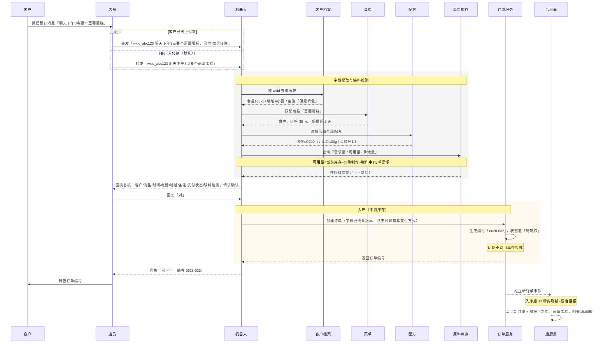
```mermaid
sequenceDiagram
    participant 客户
    participant 店员
    participant 机器人
    participant 档案 as 客户档案
    participant 菜单
    participant 配方
    participant 库存 as 原料库存
    participant 订单 as 订单服务
    participant 屏 as 后厨屏

    客户->>店员: 微信预订消息「明天下午3点要个蓝莓蛋糕」

    alt 客户已线上付款
        店员->>机器人: 转发「wxid_abc123 明天下午3点要个蓝莓蛋糕，已付 微信转账」
    else 客户未付款（默认）
        店员->>机器人: 转发「wxid_abc123 明天下午3点要个蓝莓蛋糕」
    end

    rect rgb(245, 245, 245)
    Note over 机器人,库存: 字段提取与缺料检测
    机器人->>档案: 按 wxid 查询历史
    档案-->>机器人: 电话138xx / 地址A小区 / 备注「偏爱紫色」
    机器人->>菜单: 匹配商品「蓝莓蛋糕」
    菜单-->>机器人: 命中，价格 38 元，保质期 2 天
    机器人->>配方: 读取蓝莓蛋糕配方
    配方-->>机器人: 淡奶油200ml / 蓝莓100g / 蛋糕胚1个
    机器人->>库存: 查询「需求量 / 可用量 / 承诺量」
    Note over 机器人,库存: 可用量=当前库存−Σ(待制作+制作中)订单需求
    库存-->>机器人: 各原料均充足（不缺料）
    end

    机器人-->>店员: 回执复核：客户/商品/时间/电话/地址/备注/支付状态/缺料检测，请求确认
    店员->>机器人: 回复「对」

    rect rgb(255, 250, 240)
    Note over 机器人,订单: 入库（不扣库存）
    机器人->>订单: 创建订单（字段已确认版本，含支付状态与支付方式）
    订单->>订单: 生成编号「0628-032」，状态置「待制作」
    Note over 订单: 此处不调用库存扣减
    订单-->>机器人: 返回订单编号
    end

    机器人-->>店员: 回执「已下单，编号 0628-032」
    店员->>客户: 转告订单编号

    订单--)屏: 推送新订单事件
    Note over 屏: 入库后 ≤2 秒内刷新+语音播报
    屏->>屏: 高亮新订单 + 播报「新单，蓝莓蛋糕，明天15:00取」
```

**验收要点**：
- 回执必须在 5 秒内返回
- 入库时不发生任何库存扣减动作
- 后厨屏刷新延迟 ≤2 秒
- 店员在创建消息中附带「已付 + 支付方式」时，回执必须显示支付状态、订单入库按已付写入；未附带时默认未付、支付方式为空

---

### 故事 2：消息缺信息时机器人追问

**对应需求**：第二章故事 2
**核心约束**：商品匹配不上时必须列出可选商品；wxid 不在档案时必须先收集电话/地址再下单。

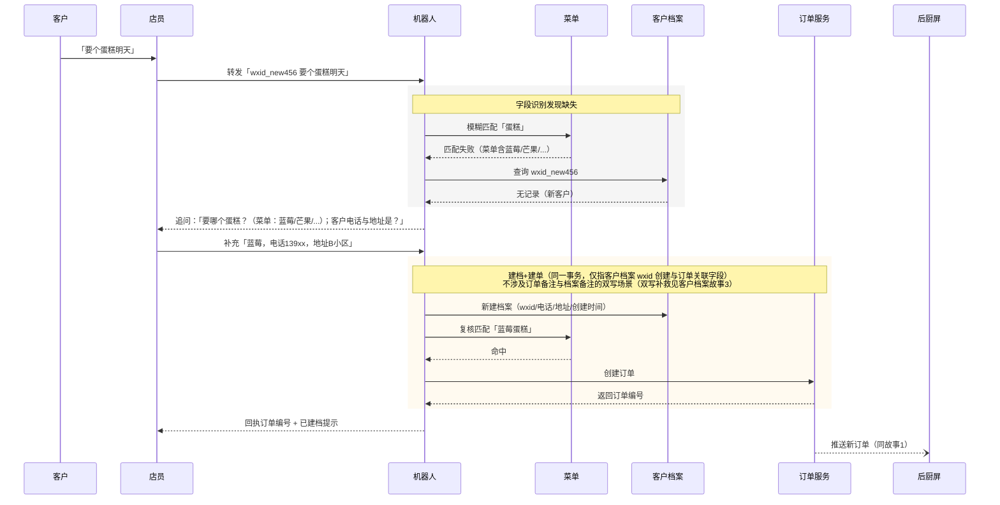
```mermaid
sequenceDiagram
    participant 客户
    participant 店员
    participant 机器人
    participant 菜单
    participant 档案 as 客户档案
    participant 订单 as 订单服务
    participant 屏 as 后厨屏

    客户->>店员: 「要个蛋糕明天」
    店员->>机器人: 转发「wxid_new456 要个蛋糕明天」

    rect rgb(245, 245, 245)
    Note over 机器人,档案: 字段识别发现缺失
    机器人->>菜单: 模糊匹配「蛋糕」
    菜单-->>机器人: 匹配失败（菜单含蓝莓/芒果/...）
    机器人->>档案: 查询 wxid_new456
    档案-->>机器人: 无记录（新客户）
    end

    机器人-->>店员: 追问：「要哪个蛋糕？（菜单：蓝莓/芒果/...）；客户电话与地址是？」
    店员->>机器人: 补充「蓝莓，电话139xx，地址B小区」

    rect rgb(255, 250, 240)
    Note over 机器人,订单: 建档+建单（同一事务，仅指客户档案 wxid 创建与订单关联字段）<br/>不涉及订单备注与档案备注的双写场景（双写补救见客户档案故事3）
    机器人->>档案: 新建档案（wxid/电话/地址/创建时间）
    机器人->>菜单: 复核匹配「蓝莓蛋糕」
    菜单-->>机器人: 命中
    机器人->>订单: 创建订单
    订单-->>机器人: 返回订单编号
    end

    机器人-->>店员: 回执订单编号 + 已建档提示
    订单--)屏: 推送新订单（同故事1）
```

**验收要点**：
- 商品匹配失败时必须把可选菜单列出
- 新客户必须先建立档案（电话+地址）才能完成下单

---

### 故事 3：客户到店取货

**对应需求**：第二章故事 3
**核心约束**：按编号 1 秒内显示订单详情并展示当前支付状态；按钮可用性由支付状态决定——未付订单只能点「已付款 / 已交付」（合并操作，记录支付方式与收款时间戳），已付订单只能点「已交付」（仅切状态，支付状态保持不变）。

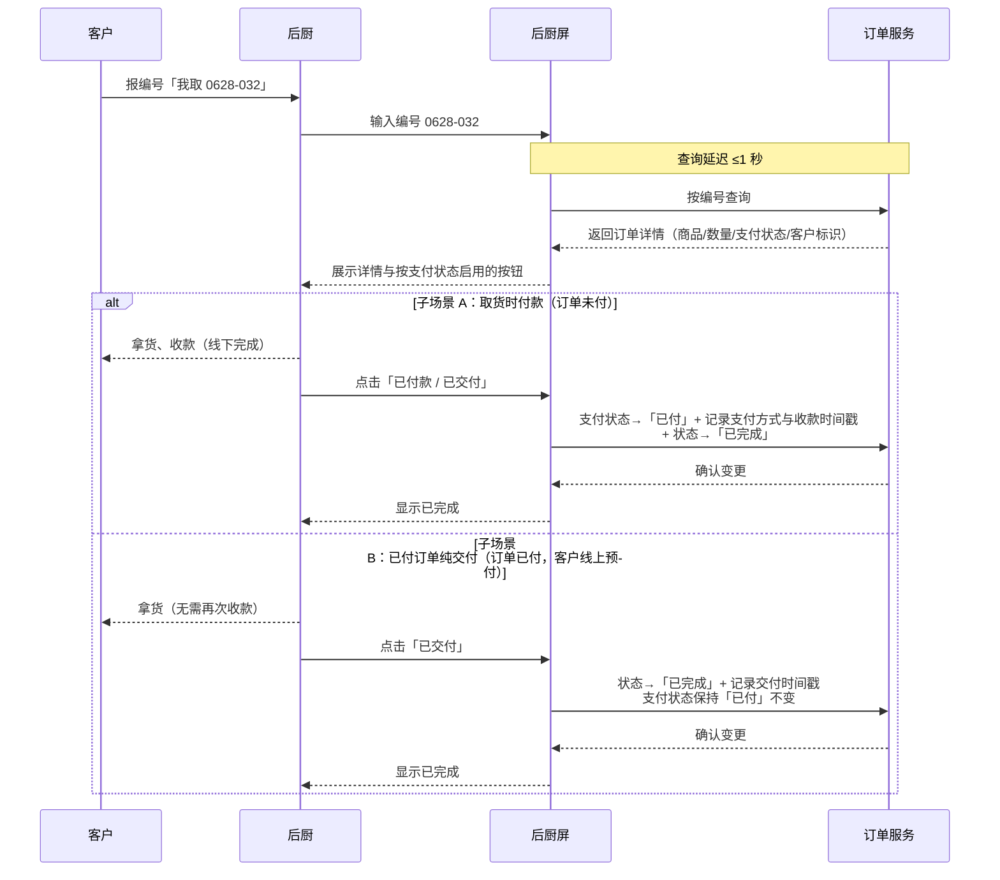
```mermaid
sequenceDiagram
    participant 客户
    participant 后厨
    participant 屏 as 后厨屏
    participant 订单 as 订单服务

    客户->>后厨: 报编号「我取 0628-032」
    后厨->>屏: 输入编号 0628-032

    Note over 屏,订单: 查询延迟 ≤1 秒
    屏->>订单: 按编号查询
    订单-->>屏: 返回订单详情（商品/数量/支付状态/客户标识）
    屏-->>后厨: 展示详情与按支付状态启用的按钮

    alt 子场景 A：取货时付款（订单未付）
        后厨-->>客户: 拿货、收款（线下完成）
        后厨->>屏: 点击「已付款 / 已交付」
        屏->>订单: 支付状态→「已付」+ 记录支付方式与收款时间戳<br/>+ 状态→「已完成」
        订单-->>屏: 确认变更
        屏-->>后厨: 显示已完成
    else 子场景 B：已付订单纯交付（订单已付，客户线上预付）
        后厨-->>客户: 拿货（无需再次收款）
        后厨->>屏: 点击「已交付」
        屏->>订单: 状态→「已完成」+ 记录交付时间戳<br/>支付状态保持「已付」不变
        订单-->>屏: 确认变更
        屏-->>后厨: 显示已完成
    end
```

**验收要点**：
- 订单详情必须显式展示当前支付状态（已付/未付），按钮可用性由支付状态决定，避免后厨误操作
- 子场景 A 状态变更必须同步落账收款时间戳与支付方式，不能事后补
- 子场景 B 只切订单状态，不得触发二次收款或支付状态变更
- 此流程仅适用于自取订单的「待取」状态

---

### 故事 4：客户取消订单（按订单状态分支）

**对应需求**：第二章故事 4
**核心约束**：取消必须留痕（含取消时状态、采用的回滚策略、操作人）；库存回滚策略由订单当前状态决定，配送中状态系统不自动调整库存。

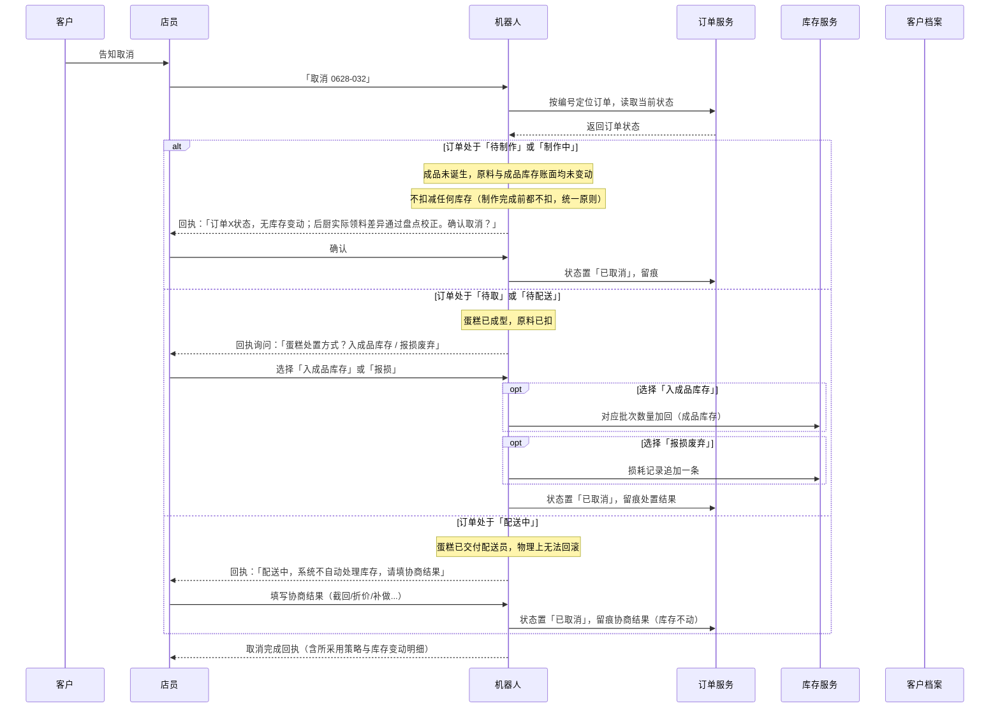
```mermaid
sequenceDiagram
    participant 客户
    participant 店员
    participant 机器人
    participant 订单 as 订单服务
    participant 库存 as 库存服务
    participant 档案 as 客户档案

    客户->>店员: 告知取消
    店员->>机器人: 「取消 0628-032」
    机器人->>订单: 按编号定位订单，读取当前状态
    订单-->>机器人: 返回订单状态

    alt 订单处于「待制作」或「制作中」
        Note over 机器人: 成品未诞生，原料与成品库存账面均未变动
        Note over 机器人: 不扣减任何库存（制作完成前都不扣，统一原则）
        机器人-->>店员: 回执：「订单X状态，无库存变动；后厨实际领料差异通过盘点校正。确认取消？」
        店员->>机器人: 确认
        机器人->>订单: 状态置「已取消」，留痕

    else 订单处于「待取」或「待配送」
        Note over 机器人: 蛋糕已成型，原料已扣
        机器人-->>店员: 回执询问：「蛋糕处置方式？入成品库存 / 报损废弃」
        店员->>机器人: 选择「入成品库存」或「报损」

        opt 选择「入成品库存」
            机器人->>库存: 对应批次数量加回（成品库存）
        end
        opt 选择「报损废弃」
            机器人->>库存: 损耗记录追加一条
        end
        机器人->>订单: 状态置「已取消」，留痕处置结果

    else 订单处于「配送中」
        Note over 机器人: 蛋糕已交付配送员，物理上无法回滚
        机器人-->>店员: 回执：「配送中，系统不自动处理库存，请填协商结果」
        店员->>机器人: 填写协商结果（截回/折价/补做...）
        机器人->>订单: 状态置「已取消」，留痕协商结果（库存不动）
    end

    机器人-->>店员: 取消完成回执（含所采用策略与库存变动明细）
```

**特殊情况：配送员退回**（蛋糕实物回到店里）

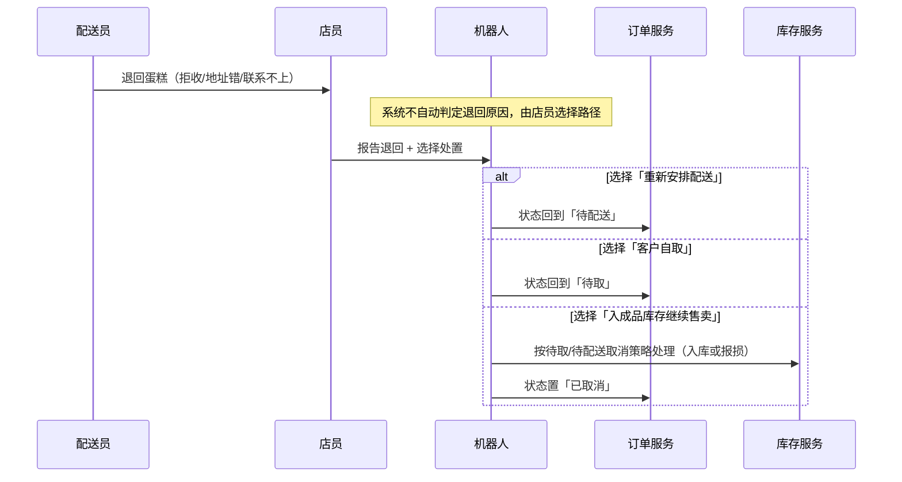
```mermaid
sequenceDiagram
    participant 配送员
    participant 店员
    participant 机器人
    participant 订单 as 订单服务
    participant 库存 as 库存服务

    配送员->>店员: 退回蛋糕（拒收/地址错/联系不上）
    Note over 机器人: 系统不自动判定退回原因，由店员选择路径
    店员->>机器人: 报告退回 + 选择处置

    alt 选择「重新安排配送」
        机器人->>订单: 状态回到「待配送」
    else 选择「客户自取」
        机器人->>订单: 状态回到「待取」
    else 选择「入成品库存继续售卖」
        机器人->>库存: 按待取/待配送取消策略处理（入库或报损）
        机器人->>订单: 状态置「已取消」
    end
```

**验收要点**：
- 3 个状态分支的回滚策略必须严格按上图执行（待制作/制作中合并为同一种处理）
- 取消记录必须包含：取消时间、取消时状态、采用的策略、操作人
- 待制作/制作中取消时库存不得变动；后厨实际领料差异通过盘点校正，不在取消动作中处理
- 配送中取消时库存不得自动调整

---

### 故事 5：客户改单

**对应需求**：第二章故事 5
**核心约束**：仅「待制作」状态允许改单；商品/数量变化必须重做缺料检测；改单订单自身按新值计入承诺量；已付订单的价差不自动退补，仅提示店员与客户协商。

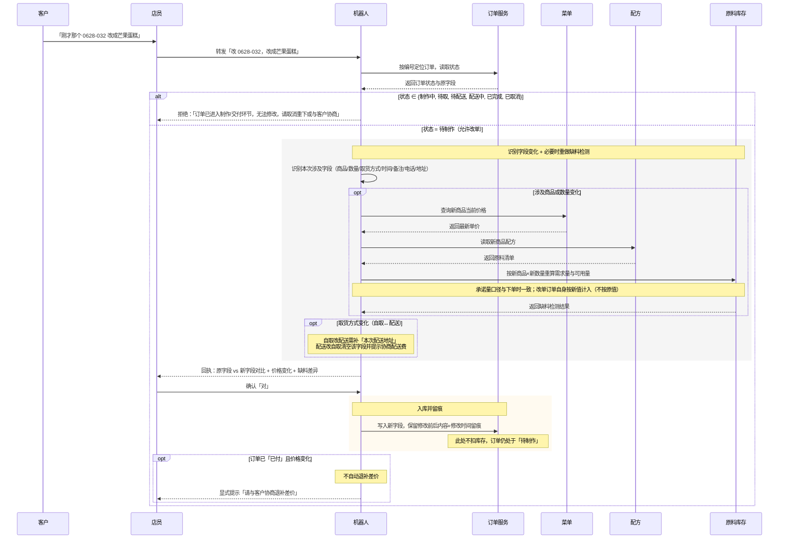
```mermaid
sequenceDiagram
    participant 客户
    participant 店员
    participant 机器人
    participant 订单 as 订单服务
    participant 菜单
    participant 配方
    participant 库存 as 原料库存

    客户->>店员: 「刚才那个 0628-032 改成芒果蛋糕」
    店员->>机器人: 转发「改 0628-032，改成芒果蛋糕」

   机器人->>订单: 按编号定位订单，读取状态
    订单-->>机器人: 返回订单状态与原字段

    alt 状态 ∈ {制作中, 待取, 待配送, 配送中, 已完成, 已取消}
        机器人-->>店员: 拒绝：「订单已进入制作/交付环节，无法修改，请取消重下或与客户协商」
    else 状态 = 待制作（允许改单）

        rect rgb(245, 245, 245)
        Note over 机器人,库存: 识别字段变化 + 必要时重做缺料检测
        机器人->>机器人: 识别本次涉及字段（商品/数量/取货方式/时间/备注/电话/地址）

        opt 涉及商品或数量变化
            机器人->>菜单: 查询新商品当前价格
            菜单-->>机器人: 返回最新单价
            机器人->>配方: 读取新商品配方
            配方-->>机器人: 返回原料清单
            机器人->>库存: 按新商品×新数量重算需求量与可用量
            Note over 机器人,库存: 承诺量口径与下单时一致；改单订单自身按新值计入（不按原值）
            库存-->>机器人: 返回缺料检测结果
        end

        opt 取货方式变化（自取↔配送）
            Note over 机器人: 自取改配送需补「本次配送地址」<br/>配送改自取清空该字段并提示协商配送费
        end
        end

        机器人-->>店员: 回执：原字段 vs 新字段对比 + 价格变化 + 缺料差异
        店员->>机器人: 确认「对」

        rect rgb(255, 250, 240)
        Note over 机器人,订单: 入库并留痕
        机器人->>订单: 写入新字段，保留修改前后内容+修改时间留痕
        Note over 订单: 此处不扣库存，订单仍处于「待制作」
        end

        opt 订单已「已付」且价格变化
            Note over 机器人: 不自动退补差价
            机器人-->>店员: 显式提示「请与客户协商退补差价」
        end
    end
```

**验收要点**：
- 状态判断必须在最前面，非「待制作」直接拒绝
- 字段对比与缺料差异必须显示在回执中
- 改单订单自身按改单后的新值计入承诺量（不按原值），避免改单后承诺量与实际需求口径错位
- 留痕必须包含修改前后内容（不覆盖原值）

---

### 故事 6：后厨开始制作

**对应需求**：第二章故事 6
**核心约束**：订单必须处于「待制作」状态；后厨主动选择「现做」或「从成品库存扣减」两条路径，系统不自动切换；此步骤不扣减任何原料库存（原料扣减触发点统一为成品诞生）。

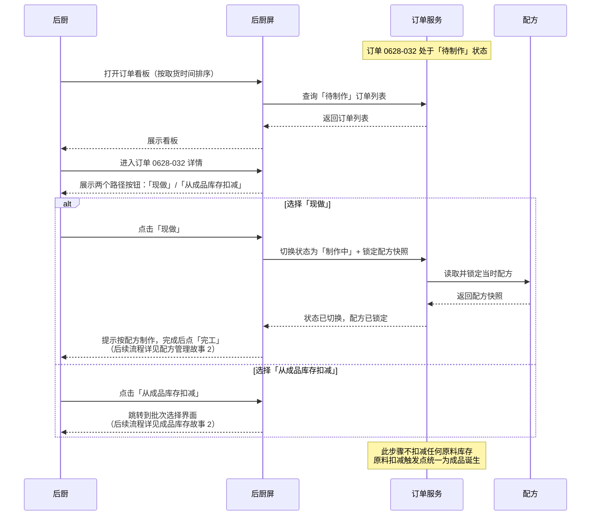
```mermaid
sequenceDiagram
    participant 后厨
    participant 屏 as 后厨屏
    participant 订单 as 订单服务
    participant 配方

    Note over 订单: 订单 0628-032 处于「待制作」状态

    后厨->>屏: 打开订单看板（按取货时间排序）
    屏->>订单: 查询「待制作」订单列表
    订单-->>屏: 返回订单列表
    屏-->>后厨: 展示看板

    后厨->>屏: 进入订单 0628-032 详情
    屏-->>后厨: 展示两个路径按钮：「现做」/「从成品库存扣减」

    alt 选择「现做」
        后厨->>屏: 点击「现做」
        屏->>订单: 切换状态为「制作中」+ 锁定配方快照
        订单->>配方: 读取并锁定当时配方
        配方-->>订单: 返回配方快照
        订单-->>屏: 状态已切换，配方已锁定
        屏-->>后厨: 提示按配方制作，完成后点「完工」<br/>（后续流程详见配方管理故事 2）
    else 选择「从成品库存扣减」
        后厨->>屏: 点击「从成品库存扣减」
        屏-->>后厨: 跳转到批次选择界面<br/>（后续流程详见成品库存故事 2）
    end

    Note over 订单: 此步骤不扣减任何原料库存<br/>原料扣减触发点统一为成品诞生
```

**验收要点**：
- 订单状态校验：仅「待制作」状态允许触发，其他状态拒绝
- 路径选择必须由后厨主动操作，系统不自动切换
- 选「现做」时立即锁定配方快照（后续扣料按快照口径）
- 此步骤不扣减任何原料库存

---

### 故事 7：配送订单送达关闭

**对应需求**：第二章故事 7
**核心约束**：订单必须处于「配送中」状态才能通过机器人关闭；按订单支付状态走两个子场景——送达付款（标记已付 + 已完成）或已付送达（仅切状态）；状态校验失败时机器人必须拒绝并告知当前状态。

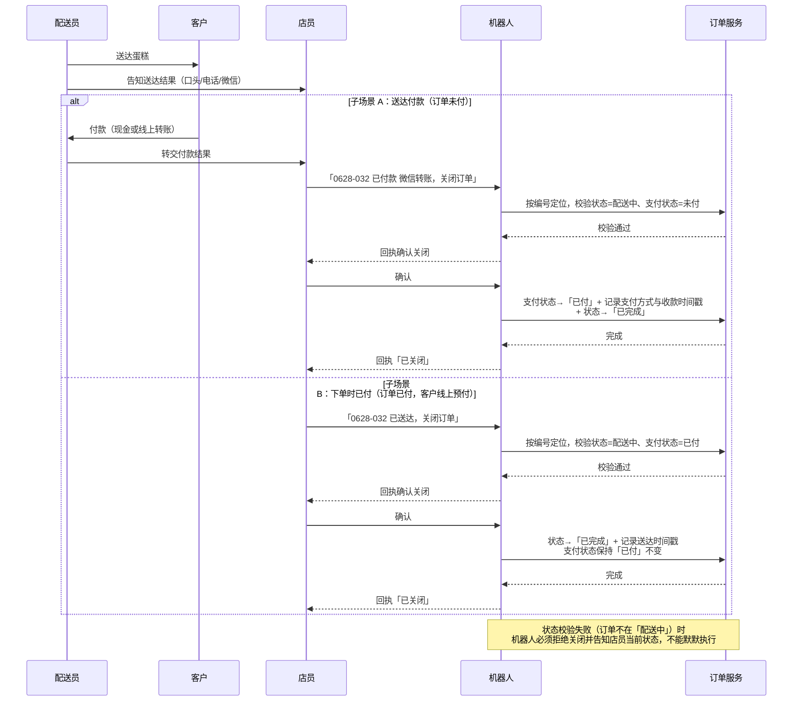
```mermaid
sequenceDiagram
    participant 配送员
    participant 客户
    participant 店员
    participant 机器人
    participant 订单 as 订单服务

    配送员->>客户: 送达蛋糕
    配送员->>店员: 告知送达结果（口头/电话/微信）

    alt 子场景 A：送达付款（订单未付）
        客户->>配送员: 付款（现金或线上转账）
        配送员->>店员: 转交付款结果
        店员->>机器人: 「0628-032 已付款 微信转账，关闭订单」
        机器人->>订单: 按编号定位，校验状态=配送中、支付状态=未付
        订单-->>机器人: 校验通过
        机器人-->>店员: 回执确认关闭
        店员->>机器人: 确认
        机器人->>订单: 支付状态→「已付」+ 记录支付方式与收款时间戳<br/>+ 状态→「已完成」
        订单-->>机器人: 完成
        机器人-->>店员: 回执「已关闭」
    else 子场景 B：下单时已付（订单已付，客户线上预付）
        店员->>机器人: 「0628-032 已送达，关闭订单」
        机器人->>订单: 按编号定位，校验状态=配送中、支付状态=已付
        订单-->>机器人: 校验通过
        机器人-->>店员: 回执确认关闭
        店员->>机器人: 确认
        机器人->>订单: 状态→「已完成」+ 记录送达时间戳<br/>支付状态保持「已付」不变
        订单-->>机器人: 完成
        机器人-->>店员: 回执「已关闭」
    end

    Note over 机器人,订单: 状态校验失败（订单不在「配送中」）时<br/>机器人必须拒绝关闭并告知店员当前状态，不能默默执行
```

**验收要点**：
- 状态校验：仅「配送中」状态允许通过机器人关闭，「待配送」需走取消流程（详见订单管理故事 4）
- 子场景 A 必须同时记录支付方式与收款时间戳
- 子场景 B 不得触发二次收款或支付状态变更
- 关闭操作留痕：订单编号、关闭时支付状态、所采用路径、操作人、操作时间

---

## 三、客户档案

客户档案存储客户的稳定属性（电话列表、地址列表、备注列表），支撑订单字段自动填充与偏好提醒。

### 故事 1：新客户首次下单建立档案

**对应需求**：第三章故事 1
**核心约束**：陌生 wxid 必须先建档（至少 1 个电话、1 个地址）才能完成下单；后续相同 wxid 必须能匹配到该档案。

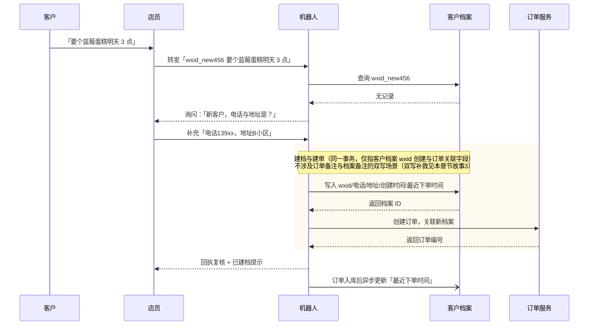
```mermaid
sequenceDiagram
    participant 客户
    participant 店员
    participant 机器人
    participant 档案 as 客户档案
    participant 订单 as 订单服务

    客户->>店员: 「要个蓝莓蛋糕明天 3 点」
    店员->>机器人: 转发「wxid_new456 要个蓝莓蛋糕明天 3 点」

    机器人->>档案: 查询 wxid_new456
    档案-->>机器人: 无记录

    机器人-->>店员: 询问：「新客户，电话与地址是？」
    店员->>机器人: 补充「电话139xx，地址B小区」

    rect rgb(255, 250, 240)
    Note over 机器人,档案: 建档与建单（同一事务，仅指客户档案 wxid 创建与订单关联字段）<br/>不涉及订单备注与档案备注的双写场景（双写补救见本章节故事3）
    机器人->>档案: 写入 wxid/电话/地址/创建时间/最近下单时间
    档案-->>机器人: 返回档案 ID
    机器人->>订单: 创建订单，关联新档案
    订单-->>机器人: 返回订单编号
    end

    机器人-->>店员: 回执复核 + 已建档提示
    机器人-)档案: 订单入库后异步更新「最近下单时间」
```

**验收要点**：
- 档案中无 wxid 时必须先提示补充电话/地址
- 后续相同 wxid 下单必须能匹配到本档案（建档后立即生效）

---

### 故事 2：档案拉取与店员复核

**对应需求**：第三章故事 2
**核心约束**：档案中存在多个电话/地址时必须列出让店员选；仅 1 个时直接使用并在回执显示。

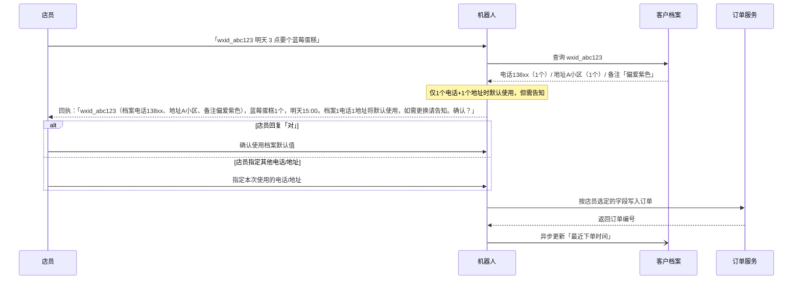
```mermaid
sequenceDiagram
    participant 店员
    participant 机器人
    participant 档案 as 客户档案
    participant 订单 as 订单服务

    店员->>机器人: 「wxid_abc123 明天 3 点要个蓝莓蛋糕」
    机器人->>档案: 查询 wxid_abc123
    档案-->>机器人: 电话138xx（1个）/ 地址A小区（1个）/ 备注「偏爱紫色」

    Note over 机器人: 仅1个电话+1个地址时默认使用，但需告知

    机器人-->>店员: 回执：「wxid_abc123（档案电话138xx、地址A小区、备注偏爱紫色），蓝莓蛋糕1个，明天15:00。档案1电话1地址将默认使用，如需更换请告知。确认？」

    alt 店员回复「对」
        店员->>机器人: 确认使用档案默认值
    else 店员指定其他电话/地址
        店员->>机器人: 指定本次使用的电话/地址
    end

    机器人->>订单: 按店员选定的字段写入订单
    订单-->>机器人: 返回订单编号
    机器人-)档案: 异步更新「最近下单时间」
```

**验收要点**：
- 多电话/地址场景必须列出所有候选让店员选
- 最终入库字段必须使用店员选定的版本，不能默认覆盖

---

### 故事 3：偏好备注的提取与提醒

**对应需求**：第三章故事 3
**核心约束**：通过提示词准确区分「本次特殊要求」（写入订单备注）与「长期偏好」（询问后写入档案备注）。

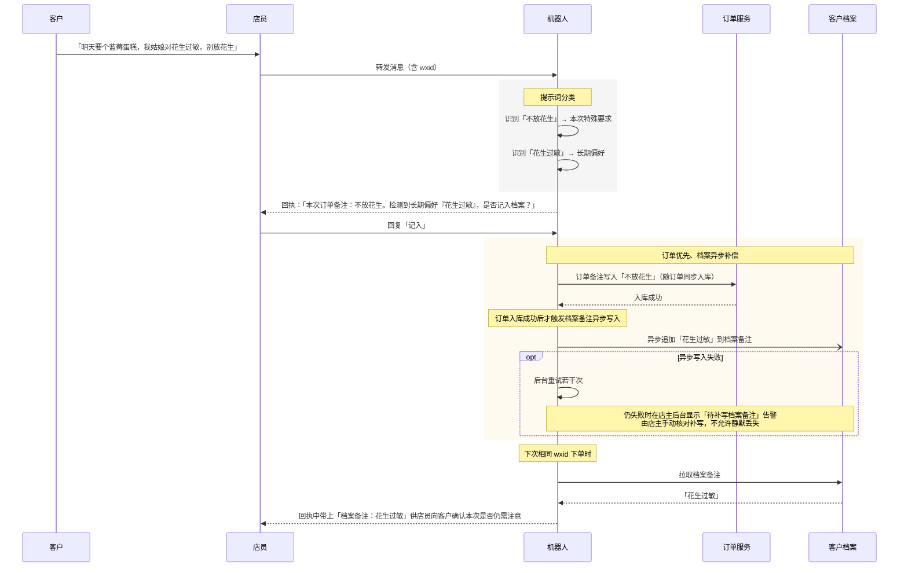
```mermaid
sequenceDiagram
    participant 客户
    participant 店员
    participant 机器人
    participant 订单 as 订单服务
    participant 档案 as 客户档案

    客户->>店员: 「明天要个蓝莓蛋糕，我姑娘对花生过敏，别放花生」
    店员->>机器人: 转发消息（含 wxid）

    rect rgb(245, 245, 245)
    Note over 机器人: 提示词分类
    机器人->>机器人: 识别「不放花生」→ 本次特殊要求
    机器人->>机器人: 识别「花生过敏」→ 长期偏好
    end

    机器人-->>店员: 回执：「本次订单备注：不放花生。检测到长期偏好『花生过敏』，是否记入档案？」
    店员->>机器人: 回复「记入」

    rect rgb(255, 250, 240)
    Note over 机器人,档案: 订单优先、档案异步补偿
    机器人->>订单: 订单备注写入「不放花生」（随订单同步入库）
    订单-->>机器人: 入库成功
    Note over 机器人: 订单入库成功后才触发档案备注异步写入
    机器人-)档案: 异步追加「花生过敏」到档案备注

    opt 异步写入失败
        机器人->>机器人: 后台重试若干次
        Note over 机器人,档案: 仍失败时在店主后台显示「待补写档案备注」告警<br/>由店主手动核对补写，不允许静默丢失
    end
    end

    Note over 机器人: 下次相同 wxid 下单时
    机器人->>档案: 拉取档案备注
    档案-->>机器人: 「花生过敏」
    机器人-->>店员: 回执中带上「档案备注：花生过敏」供店员向客户确认本次是否仍需注意
```

**验收要点**：
- 区分准确性由提示词保证，分类错误通过事后优化提示词改进
- 长期偏好写入档案必须经店员确认，不能默认入库
- 订单备注失败必须整单回滚；档案备注允许延迟落账但不能静默丢失（失败时后台告警+店主手动补写）

---

## 四、菜单管理

菜单定义「店里卖什么」，订单与成品库存均引用菜单。第一期不启用「是否定制」字段的业务逻辑。

### 故事 1：店主维护菜单

**对应需求**：第四章故事 1
**核心约束**：下架商品不能再被新订单引用；菜名修改不影响已有订单/库存记录（历史值保留）。

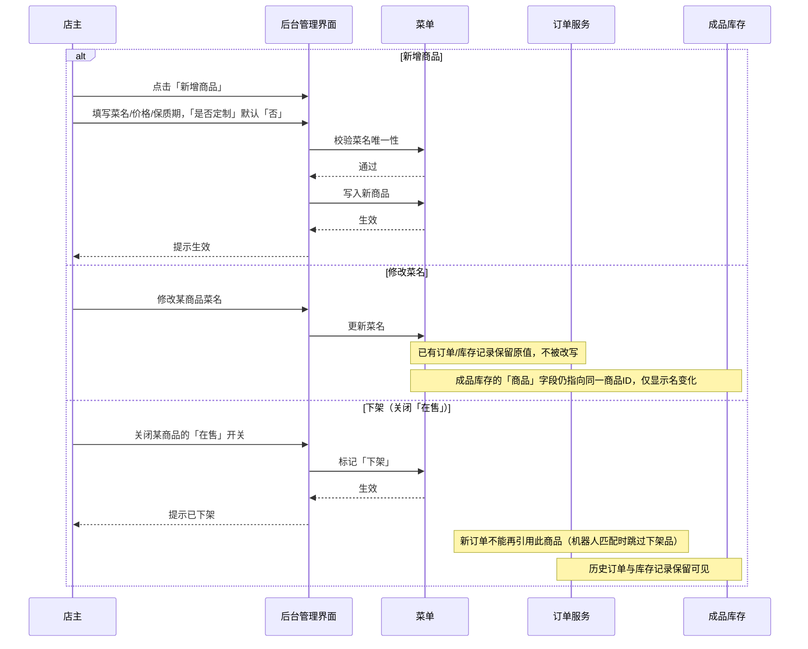
```mermaid
sequenceDiagram
    participant 店主
    participant 后台 as 后台管理界面
    participant 菜单
    participant 订单 as 订单服务
    participant 库存 as 成品库存

    alt 新增商品
        店主->>后台: 点击「新增商品」
        店主->>后台: 填写菜名/价格/保质期，「是否定制」默认「否」
        后台->>菜单: 校验菜名唯一性
        菜单-->>后台: 通过
        后台->>菜单: 写入新商品
        菜单-->>后台: 生效
        后台-->>店主: 提示生效

    else 修改菜名
        店主->>后台: 修改某商品菜名
        后台->>菜单: 更新菜名
        Note over 菜单,订单: 已有订单/库存记录保留原值，不被改写
        Note over 菜单,库存: 成品库存的「商品」字段仍指向同一商品ID，仅显示名变化

    else 下架（关闭「在售」）
        店主->>后台: 关闭某商品的「在售」开关
        后台->>菜单: 标记「下架」
        菜单-->>后台: 生效
        后台-->>店主: 提示已下架

        Note over 订单: 新订单不能再引用此商品（机器人匹配时跳过下架品）
        Note over 订单,库存: 历史订单与库存记录保留可见
    end
```

**验收要点**：
- 新增时菜名、价格、保质期为必填
- 下架后机器人菜单匹配必须跳过该商品
- 历史数据完整性不被菜名修改破坏

---

## 五、原料管理

原料管理维护原料档案与原料库存，与订单联动进行缺料检测与补货提醒。原料扣减的唯一触发点是「成品诞生」，订单创建不扣原料库存。

### 故事 1：店主维护原料档案

**对应需求**：第五章故事 1
**核心约束**：原料名、单位为必填；原料被配方引用后改名必须提示影响范围；下架后新配方不能引用，已有配方与库存记录保留。

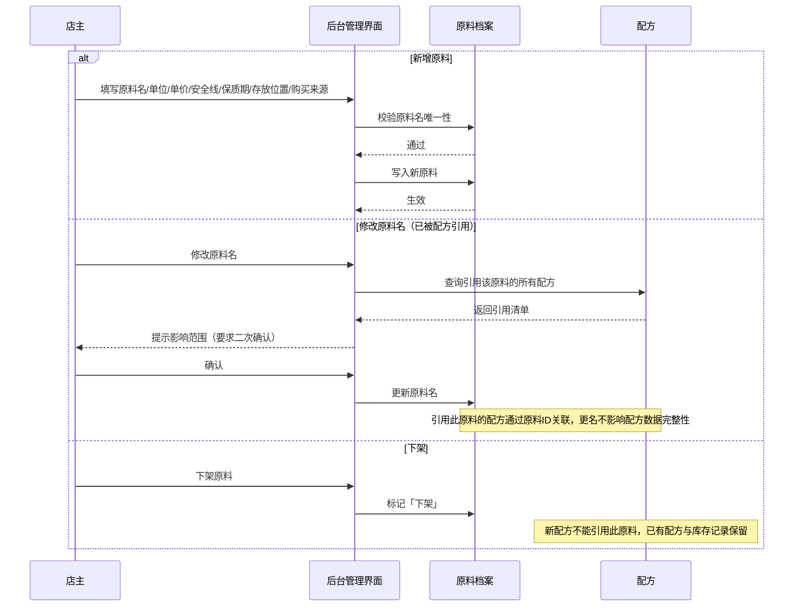
```mermaid
sequenceDiagram
    participant 店主
    participant 后台 as 后台管理界面
    participant 档案 as 原料档案
    participant 配方

    alt 新增原料
        店主->>后台: 填写原料名/单位/单价/安全线/保质期/存放位置/购买来源
        后台->>档案: 校验原料名唯一性
        档案-->>后台: 通过
        后台->>档案: 写入新原料
        档案-->>后台: 生效

    else 修改原料名（已被配方引用）
        店主->>后台: 修改原料名
        后台->>配方: 查询引用该原料的所有配方
        配方-->>后台: 返回引用清单
        后台-->>店主: 提示影响范围（要求二次确认）
        店主->>后台: 确认
        后台->>档案: 更新原料名
        Note over 档案,配方: 引用此原料的配方通过原料ID关联，更名不影响配方数据完整性

    else 下架
        店主->>后台: 下架原料
        后台->>档案: 标记「下架」
        Note over 配方: 新配方不能引用此原料，已有配方与库存记录保留
    end
```

**验收要点**：
- 改名提示必须列出所有引用方，便于评估影响
- 下架不删除历史数据

---

### 故事 2：订单创建时缺料检测

**对应需求**：第五章故事 2、第五章第 5 节
**核心约束**：可用量 = 当前库存 − Σ(待制作+制作中)订单对该原料的需求（承诺量）；订单创建不扣库存，缺料检测仅作预测性提醒。

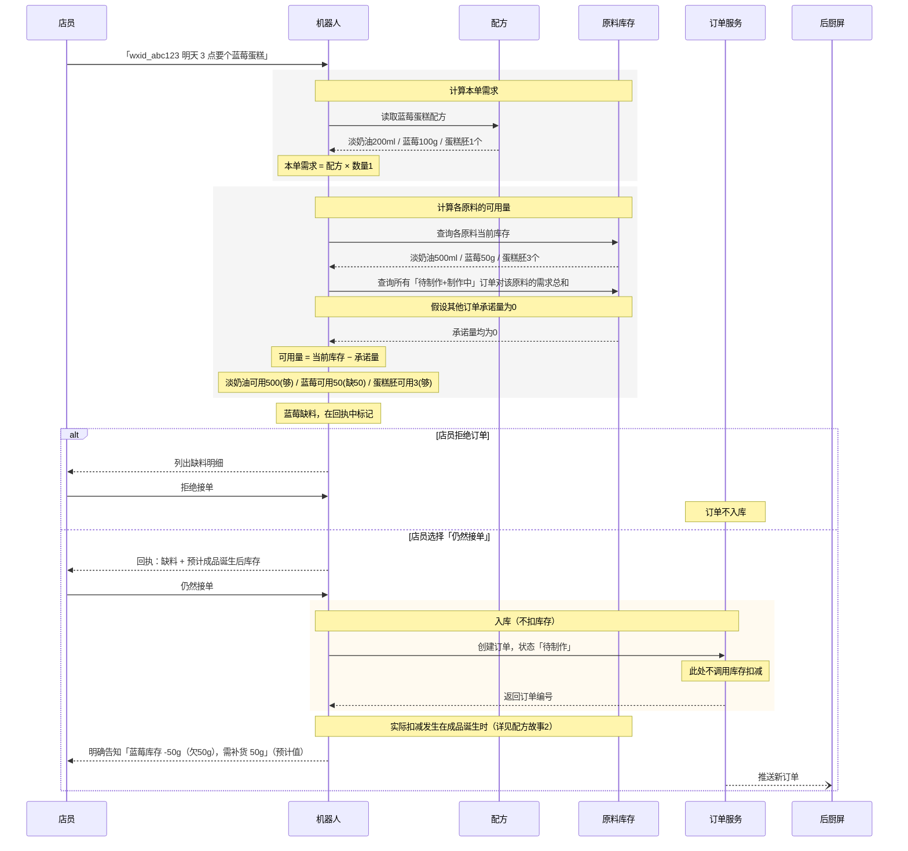
```mermaid
sequenceDiagram
    participant 店员
    participant 机器人
    participant 配方
    participant 库存 as 原料库存
    participant 订单 as 订单服务
    participant 屏 as 后厨屏

    店员->>机器人: 「wxid_abc123 明天 3 点要个蓝莓蛋糕」

    rect rgb(245, 245, 245)
    Note over 机器人,库存: 计算本单需求
    机器人->>配方: 读取蓝莓蛋糕配方
    配方-->>机器人: 淡奶油200ml / 蓝莓100g / 蛋糕胚1个
    Note over 机器人: 本单需求 = 配方 × 数量1
    end

    rect rgb(245, 245, 245)
    Note over 机器人,库存: 计算各原料的可用量
    机器人->>库存: 查询各原料当前库存
    库存-->>机器人: 淡奶油500ml / 蓝莓50g / 蛋糕胚3个

    机器人->>库存: 查询所有「待制作+制作中」订单对该原料的需求总和
    Note over 机器人,库存: 假设其他订单承诺量为0
    库存-->>机器人: 承诺量均为0

    Note over 机器人: 可用量 = 当前库存 − 承诺量
    Note over 机器人: 淡奶油可用500(够) / 蓝莓可用50(缺50) / 蛋糕胚可用3(够)
    end

    Note over 机器人: 蓝莓缺料，在回执中标记

    alt 店员拒绝订单
        机器人-->>店员: 列出缺料明细
        店员->>机器人: 拒绝接单
        Note over 订单: 订单不入库
    else 店员选择「仍然接单」
        机器人-->>店员: 回执：缺料 + 预计成品诞生后库存
        店员->>机器人: 仍然接单

        rect rgb(255, 250, 240)
        Note over 机器人,订单: 入库（不扣库存）
        机器人->>订单: 创建订单，状态「待制作」
        Note over 订单: 此处不调用库存扣减
        订单-->>机器人: 返回订单编号
        end

        Note over 机器人,库存: 实际扣减发生在成品诞生时（详见配方故事2）
        机器人-->>店员: 明确告知「蓝莓库存 -50g（欠50g），需补货 50g」（预计值）
        订单--)屏: 推送新订单
    end
```

**验收要点**：
- 承诺量必须包含所有「待制作+制作中」状态订单
- 「待取/待配送/配送中」订单不进承诺量（其消耗已反映在当前库存）
- 缺料时订单必须经店员明确决定才能入库

> **关于「扣库存路径」订单**：若该订单后续走「从成品库存扣减」路径，可用量充足不代表能履约，还需结合成品库存的批次可用量综合判断（详见成品库存故事2），二者是独立维度。

---

### 故事 3：原料库存低于安全线自动提醒

**对应需求**：第五章故事 3
**核心约束**：每次成品诞生扣减后必须立即检查所有原料；提醒包含原料名、当前库存、安全线。

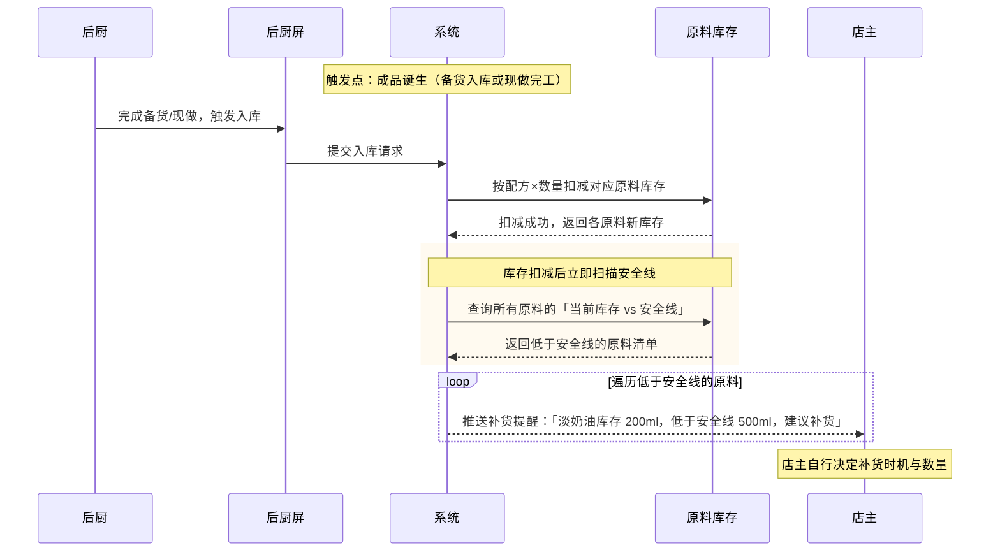
```mermaid
sequenceDiagram
    participant 后厨
    participant 屏 as 后厨屏
    participant 系统
    participant 库存 as 原料库存
    participant 店主

    Note over 系统: 触发点：成品诞生（备货入库或现做完工）
    后厨->>屏: 完成备货/现做，触发入库
    屏->>系统: 提交入库请求
    系统->>库存: 按配方×数量扣减对应原料库存
    库存-->>系统: 扣减成功，返回各原料新库存

    rect rgb(255, 250, 240)
    Note over 系统,库存: 库存扣减后立即扫描安全线
    系统->>库存: 查询所有原料的「当前库存 vs 安全线」
    库存-->>系统: 返回低于安全线的原料清单
    end

    loop 遍历低于安全线的原料
        系统-->>店主: 推送补货提醒：「淡奶油库存 200ml，低于安全线 500ml，建议补货」
    end

    Note over 店主: 店主自行决定补货时机与数量
```

**验收要点**：
- 检查时机必须是「成品诞生后」，不是「订单创建后」
- 安全线为 0（默认）的原料不触发提醒

---

### 故事 4：采购后登记入库

**对应需求**：第五章故事 4、第六章第 6 节
**核心约束**：采购登记后原料当前库存立即增加；若当前库存为负（存在欠账），自动冲减欠账。

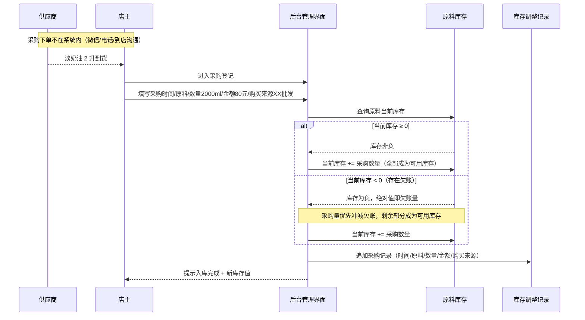
```mermaid
sequenceDiagram
    participant 供应商
    participant 店主
    participant 后台 as 后台管理界面
    participant 库存 as 原料库存
    participant 留痕 as 库存调整记录

    Note over 店主,供应商: 采购下单不在系统内（微信/电话/到店沟通）
    供应商-->>店主: 淡奶油 2 升到货

    店主->>后台: 进入采购登记
    店主->>后台: 填写采购时间/原料/数量2000ml/金额80元/购买来源XX批发
    后台->>库存: 查询原料当前库存

    alt 当前库存 ≥ 0
        库存-->>后台: 库存非负
        后台->>库存: 当前库存 += 采购数量（全部成为可用库存）
    else 当前库存 < 0（存在欠账）
        库存-->>后台: 库存为负，绝对值即欠账量
        Note over 后台,库存: 采购量优先冲减欠账，剩余部分成为可用库存
        后台->>库存: 当前库存 += 采购数量
    end

    后台->>留痕: 追加采购记录（时间/原料/数量/金额/购买来源）
    后台-->>店主: 提示入库完成 + 新库存值
```

**验收要点**：
- 登记必须包含：采购时间、原料、数量、金额（购买来源可选但推荐）
- 负库存场景的冲减顺序必须正确（先冲欠账再计可用）

---

> **关于订单取消时原料库存的处理**：策略由订单状态决定，已在订单管理故事4 时序图中完整展示（待制作/制作中：不动；待取/待配送：选入库或报损；配送中：不动），此处不重复。

---

## 六、配方管理

配方管理维护每个菜单商品对应的标准配方，作为后厨制作依据与原料需求计算基础。第一期每个商品固定一份配方，修改不留版本。

### 故事 1：店主维护配方

**对应需求**：第六章故事 1
**核心约束**：每个在售商品必须有配方（未配置的商品不能被订单引用）；配方原料必须引用档案中存在的原料。

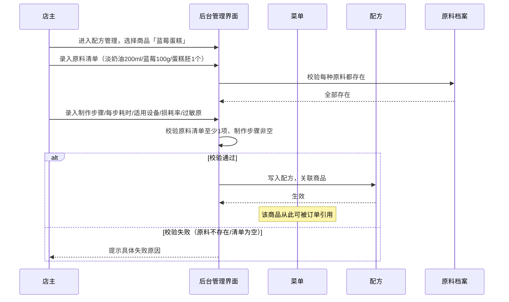
```mermaid
sequenceDiagram
    participant 店主
    participant 后台 as 后台管理界面
    participant 菜单
    participant 配方
    participant 档案 as 原料档案

    店主->>后台: 进入配方管理，选择商品「蓝莓蛋糕」

    店主->>后台: 录入原料清单（淡奶油200ml/蓝莓100g/蛋糕胚1个）
    后台->>档案: 校验每种原料都存在
    档案-->>后台: 全部存在

    店主->>后台: 录入制作步骤/每步耗时/适用设备/损耗率/过敏原
    后台->>后台: 校验原料清单至少1项、制作步骤非空

    alt 校验通过
        后台->>配方: 写入配方，关联商品
        配方-->>后台: 生效
        Note over 菜单: 该商品从此可被订单引用
    else 校验失败（原料不存在/清单为空）
        后台-->>店主: 提示具体失败原因
    end
```

**验收要点**：
- 未配置配方的商品在订单创建时必须被机器人识别为「不可下单」
- 配方原料必须经档案校验，避免脏数据

---

### 故事 2：后厨按配方制作（完工流程）

**对应需求**：第六章故事 2、第二章第 1 节状态机、第七章第 4 节
**核心约束**：「完工」按钮触发**两阶段处理**——阶段 1（成品诞生入库：扣料 + 登记入库）为本地事务，阶段 2（订单消费成品：扣成品 + 切状态）为另一个本地事务；两阶段不要求跨阶段事务，阶段 1 成功后阶段 2 失败概率极低、不专门检测，靠日常盘点兜底；按订单进入「制作中」时锁定的配方快照扣减（不受后续配方修改影响）。

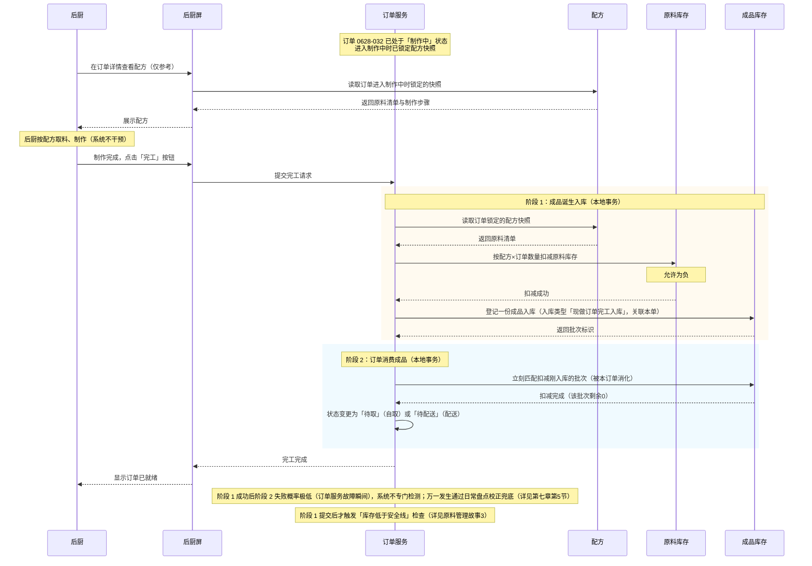
```mermaid
sequenceDiagram
    participant 后厨
    participant 屏 as 后厨屏
    participant 订单 as 订单服务
    participant 配方
    participant 库存 as 原料库存
    participant 成品 as 成品库存

    Note over 订单: 订单 0628-032 已处于「制作中」状态<br/>进入制作中时已锁定配方快照

    后厨->>屏: 在订单详情查看配方（仅参考）
    屏->>配方: 读取订单进入制作中时锁定的快照
    配方-->>屏: 返回原料清单与制作步骤
    屏-->>后厨: 展示配方

    Note over 后厨: 后厨按配方取料、制作（系统不干预）

    后厨->>屏: 制作完成，点击「完工」按钮
    屏->>订单: 提交完工请求

    rect rgb(255, 250, 240)
    Note over 订单,成品: 阶段 1：成品诞生入库（本地事务）

    订单->>配方: 读取订单锁定的配方快照
    配方-->>订单: 返回原料清单

    订单->>库存: 按配方×订单数量扣减原料库存
    Note over 库存: 允许为负
    库存-->>订单: 扣减成功

    订单->>成品: 登记一份成品入库（入库类型「现做订单完工入库」，关联本单）
    成品-->>订单: 返回批次标识
    end

    rect rgb(240, 250, 255)
    Note over 订单: 阶段 2：订单消费成品（本地事务）

    订单->>成品: 立刻匹配扣减刚入库的批次（被本订单消化）
    成品-->>订单: 扣减完成（该批次剩余0）

    订单->>订单: 状态变更为「待取」（自取）或「待配送」（配送）
    end

    订单-->>屏: 完工完成
    屏-->>后厨: 显示订单已就绪

    Note over 订单: 阶段 1 成功后阶段 2 失败概率极低（订单服务故障瞬间），系统不专门检测；万一发生通过日常盘点校正兜底（详见第七章第5节）

    Note over 订单: 阶段 1 提交后才触发「库存低于安全线」检查（详见原料管理故事3）
```

**验收要点**：
- 阶段 1（扣料 + 登记入库）必须原子化（本地事务）
- 阶段 2（扣成品 + 切状态）必须原子化（另一个本地事务）
- 两阶段不要求跨阶段事务；阶段 1 成功后阶段 2 失败概率极低，不专门检测，通过日常盘点校正兜底
- 必须按订单进入「制作中」时锁定的配方快照扣料，不受后续配方修改影响
- 入库的成品批次类型为「现做订单完工入库」，关联订单编号

---

### 故事 3：配方修改的影响提示

**对应需求**：第六章故事 3
**核心约束**：修改配方时必须列出所有「待制作」状态订单的影响，包括每个订单的需求变化与重算后的缺料预测；「制作中」及以后状态的订单账面不变。

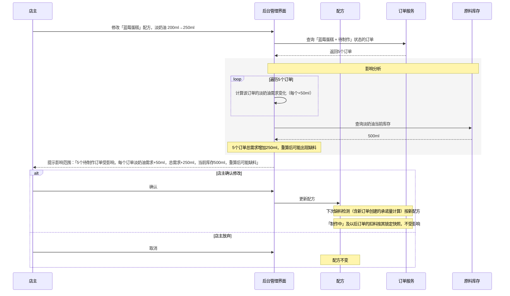
```mermaid
sequenceDiagram
    participant 店主
    participant 后台 as 后台管理界面
    participant 配方
    participant 订单 as 订单服务
    participant 库存 as 原料库存

    店主->>后台: 修改「蓝莓蛋糕」配方，淡奶油 200ml→250ml
    后台->>订单: 查询「蓝莓蛋糕 + 待制作」状态的订单
    订单-->>后台: 返回5个订单

    rect rgb(245, 245, 245)
    Note over 后台,库存: 影响分析
    loop 遍历5个订单
        后台->>后台: 计算该订单的淡奶油需求变化（每个+50ml）
    end
    后台->>库存: 查询淡奶油当前库存
    库存-->>后台: 500ml
    Note over 后台: 5个订单总需求增加250ml，重算后可能出现缺料
    end

    后台-->>店主: 提示影响范围：「5个待制作订单受影响，每个订单淡奶油需求+50ml，总需求+250ml，当前库存500ml，重算后可能缺料」

    alt 店主确认修改
        店主->>后台: 确认
        后台->>配方: 更新配方
        Note over 配方,订单: 下次缺料检测（含新订单创建的承诺量计算）按新配方
        Note over 订单,配方: 「制作中」及以后订单的扣料按其锁定快照，不受影响
    else 店主放弃
        店主->>后台: 取消
        Note over 配方: 配方不变
    end
```

**验收要点**：
- 影响提示必须在修改前展示（事前告知，不是事后通知）
- 已锁定配方的「制作中」订单不受影响，账面/扣料均按快照

---

## 七、成品库存

成品库存是「已经做好、但还没匹配订单的蛋糕」的缓冲池。

**核心设计取舍——原料扣减统一到「成品诞生」这一刻触发**（备货入库 + 现做完工两种来源，详见需求文档第七章第 1 节）：

1. **物理消耗与账面对齐**：原料物理消耗发生在做蛋糕的瞬间，账面应同步反映；订单创建只是预订归属，不扣料
2. **统一触发点 vs 路径分叉**：避免同时维护「订单创建扣料」与「成品诞生扣料」两条路径，订单创建只做预测性缺料检测
3. **现做订单的「形式化入库」**：现做完工时成品入库后立刻被本订单匹配扣减，表面经过库存、本质是「现做现领」，保持入库这一步是为了让原料扣减有统一触发点

本章 4 个故事中，故事 1（备货入库）与配方管理故事 2（现做完工）都包含「成品诞生」这一关键节点；故事 2（订单匹配扣减）展示订单如何消费已有批次（不再扣原料，避免双扣）。

### 故事 1：后厨备货入库

**对应需求**：第七章故事 1
**核心约束**：备货入库对应「成品诞生」，是一个**本地事务**（扣料 + 登记入库原子完成）；按配方×数量自动扣减原料库存（允许为负）；成品库存与原料扣减必须互相关联留痕；后厨屏立即刷新。本故事只有「成品诞生」这一阶段，不涉及订单消费（订单消费在配方管理故事 2 阶段 2 或本章节故事 2 中体现）。

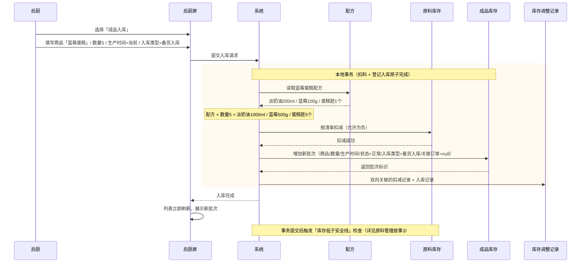
```mermaid
sequenceDiagram
    participant 后厨
    participant 屏 as 后厨屏
    participant 系统
    participant 配方
    participant 原料 as 原料库存
    participant 成品 as 成品库存
    participant 留痕 as 库存调整记录

    后厨->>屏: 选择「成品入库」
    后厨->>屏: 填写商品「蓝莓蛋糕」/ 数量5 / 生产时间=当前 / 入库类型=备货入库
    屏->>系统: 提交入库请求

    rect rgb(255, 250, 240)
    Note over 系统,成品: 本地事务（扣料 + 登记入库原子完成）

    系统->>配方: 读取蓝莓蛋糕配方
    配方-->>系统: 淡奶油200ml / 蓝莓100g / 蛋糕胚1个
    Note over 系统: 配方 × 数量5 = 淡奶油1000ml / 蓝莓500g / 蛋糕胚5个

    系统->>原料: 按清单扣减（允许为负）
    原料-->>系统: 扣减成功

    系统->>成品: 增加新批次（商品/数量/生产时间/状态=正常/入库类型=备货入库/关联订单=null）
    成品-->>系统: 返回批次标识

    系统->>留痕: 双向关联的扣减记录 + 入库记录
    end

    系统-->>屏: 入库完成
    屏->>屏: 列表立即刷新，展示新批次

    Note over 系统,原料: 事务提交后触发「库存低于安全线」检查（详见原料管理故事3）
```

**验收要点**：
- 入库记录必须包含：商品、数量、生产时间、入库类型、操作人、操作时间
- 原料扣减按「允许为负」处理
- 成品库存数量立即生效，后厨屏立即刷新

---

### 故事 2：订单匹配库存扣减

**对应需求**：第七章故事 2、第二章第 1 节状态机
**核心约束**：订单进入「待制作」后库存不发生自动扣减；后厨手动选择扣减批次；匹配扣减时原料库存不得变动（避免与入库时双扣）。

```mermaid
sequenceDiagram
    participant 后厨
    participant 屏 as 后厨屏
    participant 订单 as 订单服务
    participant 成品 as 成品库存
    participant 留痕 as 库存调整记录

    Note over 订单: 订单 0628-032 已处于「待制作」状态<br/>商品：蓝莓蛋糕 1 个

    后厨->>屏: 在订单详情查看该商品的库存批次
    屏->>成品: 查询蓝莓蛋糕所有批次及状态
    成品-->>屏: 批次A(6/27临期,剩2) / 批次B(6/28正常,剩5)
    屏-->>后厨: 展示批次列表

    Note over 后厨: 后厨自主选择（可优先消化临期批次）
    后厨->>屏: 选择批次A，确认扣减1个

    rect rgb(255, 250, 240)
    Note over 屏,订单: 本地事务
    屏->>订单: 提交匹配扣减请求

    订单->>成品: 扣减批次A 数量1
    成品-->>订单: 批次A 剩余1

    Note over 订单: 不调用原料库存扣减<br/>（批次A入库时已扣过原料）

    订单->>订单: 状态变更为「待取」（自取）或「待配送」（配送）
    订单->>留痕: 扣减记录（订单号/批次/数量/操作人/时间）
    end

    订单-->>屏: 完成
    屏-->>后厨: 显示订单已就绪
```

**验收要点**：
- 必须由后厨主动选择批次，系统不自动扣减
- 匹配扣减不触发原料库存变动（避免双扣）
- 扣减记录字段完整：订单号、批次标识、数量、操作人、时间

---

### 故事 3：临期与过期标识

**对应需求**：第七章故事 3、第七章第 3 节
**核心约束**：状态由系统基于全局临期阈值比例与菜单保质期自动计算，无需人工切换；过期报损必须记入损耗记录。

```mermaid
sequenceDiagram
    participant 后厨
    participant 店主
    participant 屏 as 后厨屏
    participant 系统
    participant 成品 as 成品库存
    participant 菜单
    participant 留痕 as 损耗记录

    Note over 后厨: 后厨打开库存列表

    屏->>系统: 拉取成品库存列表
    系统->>成品: 查询所有批次
    成品-->>系统: 返回批次及生产时间
    系统->>菜单: 查询各商品的保质期与全局临期阈值
    菜单-->>系统: 保质期2天 / 阈值20%

    rect rgb(245, 245, 245)
    Note over 系统: 计算每批状态
    loop 遍历每个批次
        Note over 系统: 剩余保质期 = 保质期 − (当前−生产时间)
        alt 剩余保质期 ≤ 0
            系统->>系统: 状态置「过期」
        else 剩余保质期 ≤ 阈值对应时长（0.4天）
            系统->>系统: 状态置「临期」
        else
            系统->>系统: 状态置「正常」
        end
    end
    end

    系统-->>屏: 返回带状态分类的批次列表
    屏-->>后厨: 按状态分色展示（正常/临期/过期）

    Note over 后厨: 决策权交给店内角色，系统不强制下架

    opt 店主决定废弃过期批次
        店主->>屏: 点击「报损」并填写原因
        屏->>成品: 扣减该批次库存
        屏->>留痕: 追加损耗记录（商品/批次/数量/原因/操作人/时间）
        留痕-->>屏: 记录成功
        屏-->>店主: 提示已报损
    end
```

**验收要点**：
- 状态计算必须在每次列表查询时实时计算（不依赖定时任务）
- 报损必须强制填写原因
- 临期与过期仅作信息展示，不强制处理

---

### 故事 4：成品库存盘点校正

**对应需求**：第七章故事 4、第七章第 5 节
**核心约束**：盘点校正必须强制填写原因；校正后状态按新数量与新生产时间重新计算；与原料库存的盘点校正机制对称。

```mermaid
sequenceDiagram
    participant 后厨
    participant 屏 as 后厨屏
    participant 系统
    participant 成品 as 成品库存
    participant 留痕 as 损耗或漂移记录
    participant 菜单

    后厨->>屏: 打开批次B详情（系统显示5个，实际4个）
    后厨->>屏: 点击「盘点校正」，改为4，填写原因「1个损坏已丢弃」

    alt 未填写原因
        屏-->>后厨: 拒绝提交（强制填原因）
    else 已填写原因
        屏->>系统: 提交校正请求（数量5→4，原因）

        rect rgb(255, 250, 240)
        Note over 系统,成品: 本地事务
        系统->>成品: 更新批次B数量为4
        系统->>留痕: 追加校正记录（商品/批次/调整前5/调整后4/原因/操作人/时间）
        系统->>菜单: 重新查询保质期与阈值
        菜单-->>系统: 返回
        系统->>成品: 按新数量与生产时间重新计算状态
        成品-->>系统: 状态更新
        end

        系统-->>屏: 校正完成
        屏-->>后厨: 列表立即反映新数量与新状态
    end
```

**验收要点**：
- 原因字段为强制，无原因不得提交
- 校正记录必须留痕（含调整前后数量）
- 状态必须重新计算（数量变化可能影响是否触发报损提醒）

---

## 八、现货销售

现货销售记录客户到店直接购买（非预订）的交易流水，匿名、不关联 wxid、不影响订单表。

### 故事 1：现货销售扣库存

**对应需求**：第八章故事 1
**核心约束**：库存扣减严格匹配所选批次；销售流水必须包含完整字段；现货销售不扣减原料库存（避免与成品入库时双扣）。

```mermaid
sequenceDiagram
    participant 客户 as 路人客户
    participant 操作者 as 后厨/店员
    participant 屏 as 后厨屏
    participant 系统
    participant 成品 as 成品库存
    participant 流水 as 销售流水
    participant 留痕 as 扣减记录

    客户->>操作者: 进店买1个蓝莓蛋糕

    操作者->>屏: 选择「现货销售」
    屏->>成品: 查询蓝莓蛋糕所有批次
    成品-->>屏: 返回批次及状态（正常/临期/过期）
    屏-->>操作者: 展示批次供操作者自主决策

    操作者->>屏: 选择批次、输入数量1、金额38元
    屏->>系统: 提交现货销售请求

    rect rgb(255, 250, 240)
    Note over 系统,流水: 本地事务
    系统->>成品: 扣减所选批次 数量1
    成品-->>系统: 扣减成功
    Note over 系统: 不调用原料库存扣减<br/>（批次入库时已扣过原料）

    系统->>流水: 写入销售记录（商品/数量/金额/扣减批次/时间/操作人/备注）
    系统->>留痕: 扣减记录（批次/数量/原因=现货销售/操作人/时间）
    end

    系统-->>屏: 完成
    屏-->>操作者: 显示扣减后库存与流水号
```

**验收要点**：
- 必须严格匹配所选批次（不能跨批次扣减）
- 流水为匿名，不写入订单表
- 不触发原料库存变动

---

## 九、接单机器人

接单机器人是店员与系统的对话入口，承担消息理解、字段提取、复核回执、订单创建。

**机器人的边界**：机器人替代「人工在页面填表单+点击按钮」这一步——它读取自然语言、按语义提取参数、调用系统功能接口（订单、客户档案、菜单、配方等服务的对外接口）。机器人不持有业务状态、不绕过接口直接读写数据库，所有业务规则由后端服务在接口层强制。时序图中机器人对各子系统的调用，本质都是「调用对应功能接口」，并非机器人直接操作内部表。

> **故事 1（标准接单）和故事 2（缺信息追问）的时序图**：与订单管理故事 1、故事 2 是同一流程，时序图见 [订单管理章节](#故事-1店员通过机器人创建新订单happy-path)。

### 故事 3：备注提取与档案联动

**对应需求**：第九章故事 3
**核心约束**：通过提示词准确区分本次特殊要求（订单备注）与长期偏好（档案备注）；长期偏好必须经店员确认后才写入档案；订单优先、档案异步补偿（订单备注失败整单回滚，档案备注失败后台告警+店主手动补写）。

> 本故事与 [客户档案故事 3](#故事-3偏好备注的提取与提醒) 描述同一场景。客户档案章节聚焦档案如何更新，本节聚焦机器人内部的分类与回执生成流程，提供另一个视角。

```mermaid
sequenceDiagram
    participant 店员
    participant 机器人
    participant 理解 as 语义理解模块
    participant 订单 as 订单服务
    participant 档案 as 客户档案
    participant 留痕 as 机器人处理留痕

    店员->>机器人: 「wxid_abc123 明天要个蓝莓蛋糕，本次写"生日快乐"，我姑娘对花生过敏」
    机器人->>留痕: 保存店员原始消息

    rect rgb(245, 245, 245)
    Note over 机器人,理解: 字段提取
    机器人->>理解: 调用提示词，分类「本次特殊要求 vs 长期偏好」
    理解-->>机器人: 本次特殊要求=「表面写生日快乐」 / 长期偏好=「花生过敏」
    机器人->>留痕: 保存识别结果
    end

    机器人->>档案: 查询 wxid_abc123 现有备注
    档案-->>机器人: 「偏爱紫色」（不含花生过敏）

    Note over 机器人: 长期偏好是新增项，需要在回执中询问店员

    机器人-->>店员: 回执：「本次订单备注：表面写生日快乐。检测到长期偏好『花生过敏』，是否记入档案？」
    机器人->>留痕: 保存回执

    店员->>机器人: 回复「记入」
    机器人->>留痕: 保存店员回复

    rect rgb(255, 250, 240)
    Note over 机器人,档案: 订单优先、档案异步补偿
    机器人->>订单: 订单备注写入「表面写生日快乐」（随订单同步入库）
    订单-->>机器人: 入库成功
    机器人->>留痕: 保存入库结果
    Note over 机器人: 订单入库成功后才触发档案备注异步写入
    机器人-)档案: 异步追加「花生过敏」到档案备注

    opt 异步写入失败
        机器人->>机器人: 后台重试若干次
        Note over 机器人,档案: 仍失败时在店主后台显示「待补写档案备注」告警<br/>由店主手动核对补写，不允许静默丢失
    end
    end

    Note over 留痕: 完整处理链路（原始消息→识别→回执→回复→入库）全部留痕
    Note over 留痕: 留痕数据系统内部保留，不展示给店员，用于事后回溯与提示词优化
```

**验收要点**：
- 提示词分类的准确性是关键（容易出错），通过留痕回溯持续优化
- 长期偏好的入库必须经店员确认，不能默认写入
- 完整处理链路留痕（便于排查分类错误）
- 订单备注与档案备注采用「订单优先、档案异步补偿」策略，避免双写不一致

---

### 故事 4：OpenClaw Bearer Token 鉴权

**对应需求**：第九章间接（鉴权属技术实现层，需求文档不写传输细节）
**对应技术方案**：§3.1 MCP 通信模式 + §5.1 鉴权双轨 + §7.2 部署拓扑
**核心约束**：Caddy 只做 TLS 终止、不做业务鉴权；Bearer Token 与 session cookie 是两套独立凭证（鉴权双轨）；token 写在 OpenClaw 配置文件中、不随工具调用频繁变化；token 轮换无需改动代码。

```mermaid
sequenceDiagram
    participant 店员
    participant 店主
    participant OpenClaw as 机器人(OpenClaw)
    participant Caddy
    participant 系统 as backend (MCP server + auth dependency)
    participant Token as api_token 表

    rect rgb(245, 245, 245)
    Note over 店主,Token: 部署期一次性配置
    店主->>Token: 签发 token（INSERT api_token）
    Token-->>店主: 返回 token 明文（仅此一次可见）
    店主->>OpenClaw: 把 token 写入 OpenClaw 配置文件
    end

    OpenClaw->>OpenClaw: 启动 → 加载配置中的 Bearer Token
    Note over OpenClaw: openclaw mcp add --transport sse https://cake-shop.example.com/mcp/sse<br/>--header "Authorization: Bearer <token>"

    rect rgb(255, 250, 240)
    Note over OpenClaw,系统: 一次 MCP 工具调用
    OpenClaw->>Caddy: POST /mcp/sse<br/>Authorization: Bearer <token>
    Caddy->>系统: TLS 终止 + 反代转发（不做鉴权）
    系统->>系统: auth dependency 解析 Authorization header
    系统->>Token: 查 token 是否存在且未失效
    Token-->>系统: token 有效

    alt token 有效
        系统->>系统: MCP server 处理工具调用
        系统-->>Caddy: 返回工具结果
        Caddy-->>OpenClaw: 转发结果
    else token 无效或失效
        系统-->>Caddy: 401 UNAUTHORIZED
        Caddy-->>OpenClaw: 转发 401
        OpenClaw->>OpenClaw: 检测到鉴权失败
        OpenClaw-->>店员: 投递回执「系统暂时不可用，请在运维群手动接单」
        Note over OpenClaw,店员: 走第十一章运维群手动接单兜底（通用退阶）<br/>token 失效属凭证层故障、根因与第十一章场景 3「订单服务挂了」不同<br/>但对外回执与兜底路径相同
    end
    end

    opt token 泄露轮换（不改动代码）
        店主->>Token: 删除旧 token 记录、签发新 token
        店主->>OpenClaw: 更新配置文件中的 token
        OpenClaw->>OpenClaw: 重启或热加载配置
        Note over OpenClaw: 旧 token 立即失效、新 token 生效
    end
```

**验收要点**：
- Caddy 配置中不含任何业务鉴权逻辑（仅 TLS + 路径转发）
- token 校验失败时 OpenClaw 立即回执店员、不静默重试
- token 轮换流程不改 backend 代码、仅靠 `api_token` 表 + OpenClaw 配置变更
- Bearer Token 与 session cookie 两套凭证互不干扰（鉴权双轨，见 §5.1）

---

### 故事 5：Plugin hook 对话留痕

**对应需求**：第九章 §9.4-(5) 五类对话痕迹
**对应技术方案**：§3.4 OpenClaw Plugin 编排 + §4.2 bot_conversation_log 表 + §5.2 内部端点 + §8.11
**核心约束**：Plugin 由本项目维护、约 50-80 行 TypeScript；hook handler 加 try/catch + 5s 超时、失败仅写 OpenClaw 侧 stderr 不阻塞主流程；第五类「最终入库订单」由 create_order service 同事务写入、不依赖 Plugin；session_id 由 Plugin 从 `ctx.sessionKey` 派生，同一 sessionKey 的多条消息归到同一 session_id。

```mermaid
sequenceDiagram
    participant 店员
    participant OpenClaw as 机器人(OpenClaw)
    participant Plugin as OpenClaw Plugin (hook handler)
    participant Caddy
    participant 系统 as backend
    participant Log as bot_conversation_log 表
    participant Order as order service

    rect rgb(245, 245, 245)
    Note over 店员,Plugin: 第 1 类痕迹：店员原始消息
    店员->>OpenClaw: 微信消息（wxid_abc123 + 客户消息文本）
    OpenClaw->>Plugin: 触发 message_received hook
    Plugin->>Plugin: 从 ctx.sessionKey 派生 session_id
    Plugin->>Caddy: POST /api/internal/bot-conversation-log<br/>Bearer Token + payload{session_id, step_type=店员原始消息, wxid, 内容}
    Caddy->>系统: TLS 终止 + 反代
    系统->>系统: auth dependency 校验 Bearer Token
    系统->>Log: INSERT 第一类痕迹
    系统-->>Plugin: 200 OK
    end

    rect rgb(255, 250, 240)
    Note over OpenClaw,Order: 工具调用链（非留痕写入、是业务流程）
    OpenClaw->>Caddy: 调 query_customer_archive MCP 工具
    Caddy->>系统: 反代
    系统-->>OpenClaw: 返回客户档案
    OpenClaw->>Caddy: 调 parse_order_message MCP 工具（内部调 check_inventory_shortage）
    系统-->>OpenClaw: 返回解析字段 + 缺料结果
    end

    rect rgb(245, 245, 245)
    Note over OpenClaw,Plugin: 第 3 类痕迹：机器人回执
    OpenClaw->>OpenClaw: LLM 组织回执（识别结果 + 缺料提示）
    OpenClaw->>店员: 投递回执到微信
    OpenClaw->>Plugin: 触发 message_sent hook
    Plugin->>系统: POST /api/internal/bot-conversation-log<br/>step_type=机器人回执
    系统->>Log: INSERT 第三类痕迹
    end

    rect rgb(245, 245, 245)
    Note over 店员,Plugin: 第 4 类痕迹：店员回复<br/>（message_received 复用：Plugin 按 Log 表是否已有该 session_id 记录判定首条/后续）
    店员->>OpenClaw: 微信回复「对」
    OpenClaw->>Plugin: 触发 message_received hook
    Plugin->>系统: POST /api/internal/bot-conversation-log<br/>step_type=店员回复（session 内后续）
    系统->>Log: INSERT 第四类痕迹
    end

    rect rgb(245, 245, 245)
    Note over OpenClaw,Plugin: 第 2 类痕迹：识别结果
    OpenClaw->>Plugin: LLM 决定调 create_order → 触发 before_tool_call hook
    Plugin->>系统: POST /api/internal/bot-conversation-log<br/>step_type=识别结果（payload=LLM 解析字段）
    系统->>Log: INSERT 第二类痕迹
    end

    rect rgb(255, 250, 240)
    Note over OpenClaw,Order: 第 5 类痕迹：最终入库订单（由 service 写、不由 Plugin 写）
    OpenClaw->>Caddy: 调 create_order MCP 工具
    Caddy->>系统: 反代
    系统->>Order: create_order service 入库
    Order->>Order: INSERT order + order_status_log CREATE
    Order->>Log: 同事务 INSERT 第五类痕迹<br/>step_type=ORDER_PERSISTED + order_id 回填本 session 全部痕迹
    Order-->>系统: 入库成功
    系统-->>OpenClaw: 返回订单编号
    end

    rect rgb(245, 245, 245)
    Note over OpenClaw,Plugin: 第 3 类痕迹：机器人回执（第二次，下单成功）
    OpenClaw->>店员: 投递「下单成功」回执
    OpenClaw->>Plugin: 触发 message_sent hook
    Plugin->>系统: POST /api/internal/bot-conversation-log
    系统->>Log: INSERT 第三类痕迹（第二次）
    end

    Note over 店员,Log: 五类痕迹齐全：原始消息 → 识别结果 → 机器人回执 → 店员回复 → 最终入库订单
```

**验收要点**：
- 五类痕迹在一次接单 happy path 中全部写入、不缺类
- 第五类痕迹由 `create_order` service 在事务内写入、`order_id` 回填到本 session 全部前四类痕迹
- Plugin handler 失败时仅写 OpenClaw stderr、不影响 OpenClaw 主流程（订单创建链路不阻塞）
- Plugin 进程挂掉期间丢失对话痕迹、但订单不丢；店主可对照 `order_status_log` 与 OpenClaw 自带 LLM 日志补全追溯
- session_id 稳定性：同一 sessionKey 的多条消息（首条原始消息 + 后续回复）归到同一 session_id

---

## 十、后厨屏

后厨屏承担订单展示、库存管理、订单核销职责。第一期硬件方案为平板 Web App。

> **故事 2（按编号查单）、故事 3（管理库存）、故事 4（记录现货销售）的时序图**：分别见 [订单管理故事 3](#故事-3客户到店取货)、[成品库存故事 1-4](#故事-1后厨备货入库)、[现货销售故事 1](#故事-1现货销售扣库存)，本节不重复。

### 故事 1：后厨实时看到新订单

**对应需求**：第十章故事 1
**核心约束**：订单入库后 ≤2 秒内后厨屏刷新+语音播报；语音必须包含商品名称与取货时间；新订单必须以高亮样式展示一段时间。

```mermaid
sequenceDiagram
    participant 订单 as 订单服务
    participant 屏 as 后厨屏
    participant 推送 as 实时推送通道
    participant 音频 as 平板音频
    participant 后厨

    Note over 订单: 订单由机器人创建并入库

    订单->>推送: 发布「新订单」事件
    Note over 推送: 推送通道通常为 WebSocket / SSE

    rect rgb(255, 250, 240)
    Note over 推送,屏: 入库到屏刷新 ≤2 秒
    推送-->>屏: 推送订单数据
    屏->>屏: 订单看板按取货时间升序插入新订单
    屏->>屏: 新订单高亮样式（持续一段时间）
    屏->>音频: 触发语音播报「新单，蓝莓蛋糕，明天15:00取」
    音频-->>后厨: 播放语音
    屏-->>后厨: 视觉提示（高亮+动画）
    end

    Note over 后厨: 后厨注意到新订单，按取货时间排序处理
```

**验收要点**：
- 推送延迟 ≤2 秒（含网络 + 渲染）
- 语音内容必须包含商品名与取货时间
- 高亮持续时长需保证后厨能注意到（建议 30-60 秒）

---

### 故事 5：后厨/店主 PIN 码登录

**对应需求**：第十章 §10.1 第 7 条（v0.8.3 新增）
**对应技术方案**：§6.2 PIN 码登录流程 + §5.2 鉴权模块 `/api/auth/*`
**核心约束**：admin（后端管理页面）与 kitchen（后厨屏）共用同一登录接口、仅 `client_type` 字段不同导致 session 有效期不同（admin=8h / kitchen=90d）；PIN 错 5 次锁 10 分钟；IP+用户名双维度限流 + 单 IP 每日上限 50 次兜底；session cookie HttpOnly + Secure + SameSite=Strict。

```mermaid
sequenceDiagram
    participant 用户 as 后厨/店主
    participant 前端 as 前端 Web App
    participant Caddy
    participant 系统 as backend (auth dependency + auth service)
    participant User as user 表

    用户->>前端: 打开浏览器加载 admin / kitchen
    前端->>前端: 检测无有效 session cookie
    前端-->>用户: 重定向到 /login

    rect rgb(255, 250, 240)
    Note over 用户,系统: 单 IP 每日上限 50 次兜底（先于 user 校验）
    用户->>前端: 输入 6 位 PIN（数字键盘）+ client_type
    前端->>Caddy: POST /api/auth/login<br/>{pin, client_type}
    Caddy->>系统: TLS 终止 + 反代（不做鉴权）
    系统->>系统: 检查该 IP 当日登录请求计数
    alt 当日 IP 计数 > 50
        系统-->>前端: 429 RATE_LIMITED（IP 兜底）
        Note over 系统: 不进 user 校验、直接拒绝该 IP 当日所有登录
    else 当日 IP 计数 ≤ 50
        系统->>User: 遍历 enabled=true 记录、对 pin_hash 用 bcrypt.checkpw
        alt locked_until > now（用户已被锁）
            User-->>系统: 用户处于锁定状态
            系统-->>前端: 429 RATE_LIMITED + detail 含剩余锁定时长
        else PIN 错误
            系统->>User: failed_attempts += 1
            alt failed_attempts 达到 5
                系统->>User: 置 locked_until = now + 10min、重置 failed_attempts = 0
            end
            系统-->>前端: 401 UNAUTHORIZED + AUTH_INVALID_PIN
        else PIN 正确
            系统->>User: 重置 failed_attempts、locked_until = NULL、更新 last_login_at
            系统->>系统: 签发 session cookie<br/>（HttpOnly + Secure + SameSite=Strict）<br/>有效期：client_type=admin → 8h<br/>client_type=kitchen → 90d
            系统-->>前端: 200 + Set-Cookie + user info（display_name / role）
            前端-->>用户: 进入主界面（操作人即登录用户）
        end
    end

    rect rgb(245, 245, 245)
    Note over 用户,系统: 后续业务请求
    用户->>前端: 操作（如改单、查库存）
    前端->>Caddy: 业务请求带 session cookie
    Caddy->>系统: 反代
    系统->>系统: auth dependency 校验 session cookie
    系统-->>前端: 业务响应
    end
```

**验收要点**：
- admin 与 kitchen 共用 `/api/auth/login` 端点、仅 `client_type` 字段决定 session 有效期（admin 8h / kitchen 90d）
- PIN 错 5 次锁定 10 分钟、返回 429 + 剩余时长；锁定期间同 PIN 再试直接 429
- 单 IP 每日上限 50 次兜底先于 user 校验、防「同 IP 对不同用户各试 5 次」的缝隙
- session cookie 三道保护：HttpOnly（防 JS 读）+ Secure（仅 HTTPS）+ SameSite=Strict（防 CSRF）
- 防爆破：浏览器路径锁 10 分钟后 6 位 PIN 需 ~3.8 年穷举

---

## 十一、应急退阶策略

系统以「运维微信群」作为最低保障通道，任何环节挂掉都退回到「店员在运维群发订单信息 + 后厨看群接单」的手动流程。所有场景恢复后都通过「补录流程」把手工期间的订单回流到系统。

> **补录流程通用约定**（适用于所有场景的恢复阶段）：
> 1. 编号按订单实际下单日期当日位置生成（不取补录日期）
> 2. 若店员在运维群期间已手工分配编号，补录优先采用（除非已被系统占用）
> 3. 下单时间取运维群消息时间或纸笔记录时间（不取补录时刻）

### 场景 1：接单机器人挂了

**对应需求**：第十一章场景 1
**现象**：店员发消息给机器人，连续多次无响应或报错。

```mermaid
sequenceDiagram
    participant 客户
    participant 店员
    participant 机器人 as "机器人(故障)"
    participant 群 as 运维群
    participant 后厨
    participant 店主
    participant 系统

    客户->>店员: 微信预订
    店员->>机器人: 转发消息
    机器人--x店员: 多次无响应或报错

    Note over 店员: 识别为机器人故障，切入手动流程

    rect rgb(255, 230, 230)
    Note over 店员,后厨: 手动接单
    店员->>群: 手动发订单信息（客户代号/商品/数量/取货时间/取货方式）
    群-->>后厨: 看到新订单
    群-->>店主: 看到新订单
    后厨-->>群: 按群消息接单
    店主->>群: 为该单分配编号并告知店员
    店员->>客户: 转告手工编号
    end

    Note over 机器人: 机器人服务恢复

    rect rgb(230, 255, 230)
    Note over 店员,系统: 恢复后补录
    店员->>机器人: 反馈运维群内容
    机器人->>机器人: 按补录流程识别、回执、确认
    机器人->>系统: 入库，下单时间取运维群消息的实际时间
    Note over 系统: 编号采用店员手工分配（除非冲突）
    end
```

---

### 场景 2：后厨屏挂了

**对应需求**：第十一章场景 2
**现象**：后厨屏黑屏、不刷新、无法操作。

```mermaid
sequenceDiagram
    participant 客户
    participant 店员
    participant 机器人
    participant 群 as 运维群
    participant 后厨
    participant 屏 as "后厨屏(故障)"

    客户->>店员: 微信预订
    店员->>机器人: 转发消息
    机器人-->>店员: 回执复核
    店员->>机器人: 确认
    机器人->>群: 正常流程本来就在运维群发一份
    Note over 屏: 后厨屏黑屏，后厨看不到

    rect rgb(255, 230, 230)
    Note over 店员,后厨: 手动同步状态
    后厨->>后厨: 看手机群消息，按取货时间排序处理
    后厨-->>群: 状态变更口头同步（开始制作/完工/已付款已交付）

    opt 客户取货付款
        后厨->>群: 报客户编号
        群-->>店员: 看到编号查询请求
        店员->>机器人: 查询订单详情
        机器人-->>店员: 返回详情
        店员->>群: 把详情报给后厨
        后厨-->>客户: 收款交货
    end
    end

    Note over 屏: 后厨屏恢复

    rect rgb(230, 255, 230)
    Note over 店员,后厨: 恢复后补录
    店员->>机器人: 把群内记录的状态变更反馈给机器人
    机器人->>机器人: 按补录流程识别、回执、确认、入库
    end
```

---

### 场景 3：订单服务挂了（机器人识别正常但订单创建接口失败）

**对应需求**：第十一章场景 3
**现象**：机器人识别订单后调用接口失败。

```mermaid
sequenceDiagram
    participant 客户
    participant 店员
    participant 机器人
    participant 订单 as "订单服务(故障)"
    participant 群 as 运维群

    客户->>店员: 微信预订
    店员->>机器人: 转发消息

    rect rgb(245, 245, 245)
    Note over 机器人: 识别正常
    机器人->>机器人: 字段提取、复核回执生成
    机器人-->>店员: 回执复核
    店员->>机器人: 确认
    end

    rect rgb(255, 230, 230)
    Note over 机器人,订单: 入库失败
    机器人->>订单: 调用订单创建接口
    订单--x机器人: 失败
    机器人->>订单: 重试若干次
    订单--x机器人: 仍然失败

    Note over 机器人: 机器人不保留原始消息，仅回执告知
    机器人-->>店员: 「系统暂时不可用，请在运维群手动接单」
    end

    Note over 店员: 店员自行保留客户原始消息（截图/复制/纸笔等任意形式）
    Note over 店员: 后续按场景1处理（运维群手动接单）

    Note over 订单: 订单服务恢复

    rect rgb(230, 255, 230)
    Note over 店员,机器人: 恢复后补录（由店员主动发起）
    店员->>机器人: 把保留的原始消息反馈给机器人
    机器人-->>店员: 重新回执复核
    店员->>机器人: 确认
    机器人->>订单: 入库成功
    end
```

---

### 场景 4：店里断网或断电

**对应需求**：第十一章场景 4
**现象**：电脑、后厨屏、机器人都不可用。

```mermaid
sequenceDiagram
    participant 客户
    participant 店员
    participant 手机 as "店员手机(4G/5G)"
    participant 机器人 as "机器人(故障)"
    participant 屏 as "后厨屏(故障)"
    participant 群 as 运维群
    participant 后厨
    participant 客户 as "客户(付款方)"

    Note over 机器人,屏: 店内网络/电力中断，系统全挂

    rect rgb(255, 230, 230)
    Note over 店员,后厨: 手机独立网络接续
    店员->>手机: 用4G/5G继续使用微信
    客户->>店员: 微信预订（店员手机收到）
    店员->>群: 手动接单
    群-->>后厨: 后厨看手机群消息

    Note over 店员,客户: 收款降级
    客户->>店员: 现金 或 转账到店主个人微信
    店员->>群: 在群内确认收款
    end

    Note over 机器人,屏: 网络恢复

    rect rgb(230, 255, 230)
    Note over 店员,机器人: 恢复后补录
    店员->>机器人: 反馈期间所有订单
    机器人->>机器人: 按补录流程逐单识别、回执、确认、入库
    end
```

---

### 场景 5：客户取货时后厨屏挂了

**对应需求**：第十一章场景 5
**现象**：客户来取货付款，后厨屏查不到订单。

```mermaid
sequenceDiagram
    participant 客户
    participant 后厨
    participant 屏 as "后厨屏(故障)"
    participant 群 as 运维群
    participant 店员
    participant 机器人

    客户->>后厨: 报编号「我取 0628-032」
    后厨->>屏: 输入编号
    屏--x后厨: 黑屏/查不到

    rect rgb(255, 230, 230)
    Note over 后厨,店员: 群内配合查询
    后厨->>群: 报客户编号「查询 0628-032」
    群-->>店员: 看到查询请求
    店员->>机器人: 查询订单详情
    机器人-->>店员: 返回详情
    店员->>群: 把详情报给后厨
    后厨-->>客户: 拿货收款
    end

    后厨->>群: 同步「0628-032 已付款已交付」
    群-->>店员: 看到

    Note over 屏: 后厨屏恢复

    rect rgb(230, 255, 230)
    Note over 店员: 恢复后补录
    店员->>机器人: 把「0628-032 已付款已交付」补录到系统
    end
```

---

### 场景 6：库存扣减异常

**对应需求**：第十一章场景 6
**现象**：库存数量对不上，扣减记录丢失或错误。

```mermaid
sequenceDiagram
    participant 后厨
    participant 店主
    participant 系统 as "系统(库存异常)"
    participant 群 as 运维群

    Note over 系统: 库存数量与实际对不上，扣减记录丢失/错误

    rect rgb(255, 230, 230)
    Note over 后厨: 停止依赖系统库存
    后厨->>后厨: 不再相信系统库存数
    后厨->>群: 每次出库入库在群内报数（例「蓝莓蛋糕出1，剩4」）
    群-->>店主: 看到出库入库流水
    Note over 后厨,店主: 用群消息作为临时账面
    end

    Note over 系统: 系统恢复

    rect rgb(230, 255, 230)
    Note over 后厨,系统: 恢复后盘点校正
    后厨->>后厨: 重新盘点实际库存
    后厨->>系统: 手动调整库存数量至实际值
    系统->>系统: 差异记入损耗记录（强制填原因）
    end
```

---

**应急场景共性验收要点**：
- 任何场景下运维群必须能承载手动接单（店员/后厨/店主都在群里）
- 补录的下单时间必须取实际下单时刻，不取补录时刻
- 双录入风险（场景 1/3 补录时）：补录前店员必须按 wxid+下单时间检索查重，机器人自动检查相同 wxid ±1 小时内是否已有相同商品+数量的订单

---

## 附录：模块间引用关系

| 当前章节 | 引用故事 | 引用自 | 说明 |
|---------|---------|--------|------|
| 接单机器人 | 故事 1、故事 2 | 订单管理故事 1、故事 2 | 同一流程 |
| 接单机器人 | 故事 3 | 客户档案故事 3 | 同一场景，视角不同 |
| 接单机器人 | 故事 4 | 技术方案 §3.1 + §5.1 + §7.2 | Bearer Token 鉴权（鉴权属技术实现、需求文档不写传输细节） |
| 接单机器人 | 故事 5 | 第九章 §9.4-(5) + 技术方案 §3.4 + §4.2 + §8.11 | 五类对话痕迹的写入路径 |
| 后厨屏 | 故事 5 | 第十章 §10.1 第 7 条 + 技术方案 §6.2 + §5.2 | PIN 码登录（admin/kitchen 共用接口） |
| 后厨屏 | 故事 2 | 订单管理故事 3 | 客户到店取货的完整流程（含按编号查单与按支付状态选按钮） |
| 后厨屏 | 故事 3 | 成品库存故事 1-4 | 库存管理流程 |
| 后厨屏 | 故事 4 | 现货销售故事 1 | 现货销售流程 |
| 原料管理 | 故事 5（取消时原料处理） | 订单管理故事 4 | 取消订单的库存分支 |

> 时序图按"完整画出一次"的原则绘制，被引用的章节不再重复绘制。如需查看被引用的流程，点击上表中的「引用自」列定位。

---

> 本文档随需求文档同步迭代。需求文档新增/调整用户故事时，本文档必须同步增删对应时序图，作为本次改动的一部分。

